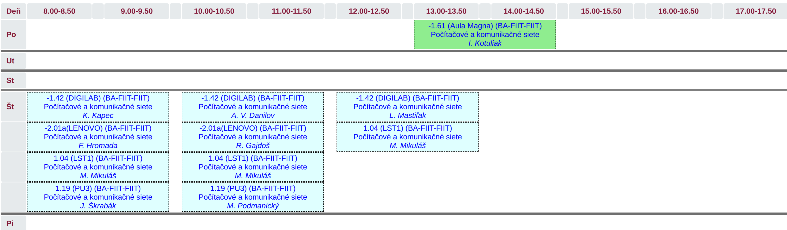
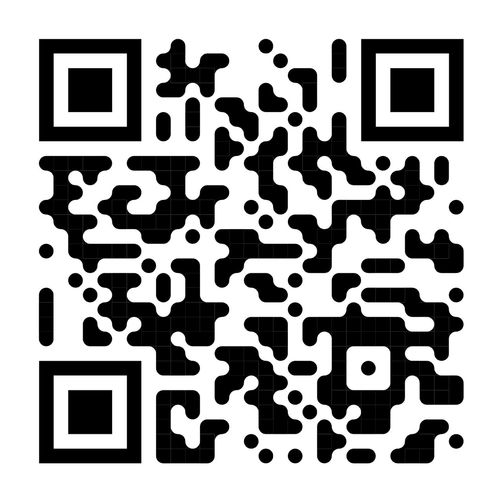

# Computer and Communication Networks : Course Organization 2026/2027

---
layout: default
---

# Team

  
  
prof. Ing. Ivan Kotuliak, PhD.

  
Garant / Prednášajúci

  
<a href="mailto:ivan.kotuliak@stuba.sk">ivan.kotuliak@stuba.sk</a>

 

  

    
    
Ing. Lukáš Mastiľak, PhD.

    
Vedúci cvičení / Prednášajúci

    
<a href="mailto:lukas.mastilak@stuba.sk">lukas.mastilak@stuba.sk</a>

  

  

    
    
Ing. Matúš Mikuláš

    
Senior cvičiaci / CCNA kurzy

    
<a href="mailto:matus.mikulas@stuba.sk">matus.mikulas@stuba.sk</a>

  

  

    
    
Bc. Július Škrabák

    
Junior cvičiaci(OPP)

    
<a href="mailto:julius.skrabak@stuba.sk">julius.skrabak@stuba.sk</a>

  

  

    
    
Bc. Kristián Kapec

    
Junior cvičiaci(OPP)

    
<a href="mailto:xkapeck@stuba.sk">xkapeck@stuba.sk</a>

  

 

  

    
Bc. Andrei Vlad Danilov

    
Junior cvičiaci(OPP)

    
<a href="mailto:xdanilov@stuba.sk">xdanilov@stuba.sk</a>

  

  

    
Bc. Filip Hromada

    
Junior cvičiaci(OPP)

    
<a href="mailto:xhromadaf@stuba.sk">xhromadaf@stuba.sk</a>

  

  

    
Bc. Martin Podmanický

    
Junior cvičiaci(OPP)

    
<a href="mailto:xpodmanickym@stuba.sk">xpodmanickym@stuba.sk</a>

  

  

    
Bc. Roman Gajdoš

    
Junior cvičiaci(OPP)

    
<a href="mailto:xgajdosr@stuba.sk">xgajdosr@stuba.sk</a>

  

---

# Timetable

---

# Podmienky na absolvovanie predmetu

|               | **Body** | **Min.** |
|---------------|------|------|
| Semester      | 50   |      |
| Skúška        | 50   |   25   |
| **Spolu**     | **100**  |   56    |

----

# Podmienky na absolvovanie predmetu

| **Klasifikačná stupnica** | **Hodnotenie** | 
|---------------|------|
| <100 - 92>      | A   |
| <91 - 83>       | B   |
| <82 - 74>       | C   |
| <73 - 65>       | D   |
| <64 - 56>       | E   |
| <55 - 0>       | FX   |

---

# Podmienky na absolvovanie predmetu

| **Semester**      | **Body** | **Min.** |
|---------------|------|------|
| Zadanie - prvá časť      | 5    |  2,5     |
| Zadanie - druhá časť     | 15   |  7,5     |
| Test-analýza, subnetting | 15   |  7,5   |
| Test-troubleshooting     | 15   |  7,5   |
| **Spolu**                | 50   |      |

---

# Opravný test

- Študent si môže **opraviť jeden test**, pri ktorom nezískal minimálny počet bodov.
- Zároveň, študent musí získať minimálny počet bodov z druhého testu v riadnom termíne.
- Za opravný test sa započíta iba 50 % získaných bodov, ktoré nahradia pôvodný (nedostatočný) výsledok.
- Opravný test sa píše v 13. týždni.
 
---

# Podmienky na absolvovanie predmetu

| **Skúška**       | **Body** | **Min.** |
|---------------|------|------|
| Písomná  | 50  |  25    |

---

# Harmonogram

| Week | Date | Lecture | Laboratory practice | Milestones |
|-------|------|------|------|-|
| 1.  | 14/9/2026  | Intro | CLI, PT, rozhrania | |
| 2.  | 21/9/2026  | Linková vrstva | Analýza rámcov, ARP (PT, Wireshark) | |
| 3.  | 28/9/2026  | Sieťová vrstva | Subnetting (PT) | Zverejnenie zadania |
| 4.  | 5/10/2026  | Úvod do transportnej vrstvy, Predstavenie zadania | UDP/TCP socket (Python) | |
| 5.  | 12/10/2026 | TCP I. | | Test - analýza rámcov, ARP, IP subnetting |
| 6.  | 19/10/2026 | TCP II. | Zadanie KB | |
| 7.  | 26/10/2026 | Aplikačná vrstva | Troubleshooting (PT) | |
| 8.  | 2/11/2026  | IPv6 | IPv6 konfigurácia (PT) | |
| 9.  | 9/11/2026  | Smerovanie | | Test - Troubleshooting |
| 10. | 16/11/2026 | Fyzická vrstva | ??? | |
| 11. | 23/11/2026 | Mobilná sieť, WiFi, Bluetooth| Doimplementácia zadania | Preberanie zadania |
| 12. | 30/11/2026 | Bezpečnosť | | Preberanie zadania |

---

# Course materials

  <a href="https://github.com/fiit-ba/PKS_B-course.git" target="_blank" rel="noopener">
    🔗 https://github.com/fiit-ba/PKS_B-course.git
  </a>

 
 

  <a href="https://teams.cloud.microsoft/l/team/19%3ABRiMzh9RfQpSqoOVo45QF9sqx5SFnFlrxEUv4Eqw2k41%40thread.tacv2/conversations?groupId=87e8632d-6b05-432e-a1d9-b33850f6fb36&tenantId=25733538-6b16-4aa3-8ed6-297eb79b8e06" target="_blank" rel="noopener">
    💬 MS Teams
  </a>

---

# Communication channels

<v-click>

  
<strong>Používajte primárne MS Teams na komunikáciu!!!</strong>

</v-click>

<v-click>

  
Každý musí mať funkčný účet na MS Teams.

</v-click>

<v-click>

  
Pýtajte sa čo najviac otázok v <strong>public kanáloch</strong>. Odpoveď môže byť užitočná aj pre vášho kolegu.

  
Odpoveď môžete očakávať najneskôr do <strong>48 hodín v pracovných dňoch</strong>. Počas víkendov je poskytovanie odpovedí dobrovoľné.

</v-click>

<v-click>

  
Kontaktujte cvičiaceho prostredníctvom súkromného kanála výhradne v prípade záležitostí osobného charakteru. Otázky týkajúce sa zadania medzi takéto záležitosti nepatria.

</v-click>

<v-click>

  
<strong>Predvytvorené kanály:</strong>

  <ul>
    <li><strong>General</strong> – pre otázky, ktoré nepatria do obsahu žiadneho iného kanála</li>
    <li><strong>QA assignment</strong> – pre otázky na zadanie </li>
    <li><strong>CCNA preskušanie </strong> – pre otázky a informácie, ktoré sa týkajú preskúšania tých, čo už majú CCNA kurz</li>
  </ul>

</v-click>

---

# Recommended literature

1. [UC Berkley. Introduction to the Internet: Architecture and Protocols](https://textbook.cs168.io/)

2. [KUROSE, James F.; ROSS, Keith W. Computer networking: A top-down approach 9th edition](https://gaia.cs.umass.edu/kurose_ross/index.php)

3. [PETERSON, Larry L.; DAVIE, Bruce S. Computer Networks: A Systems Approach](https://book.systemsapproach.org/index.html#)  
---

# Cisco Networking Academy FIIT STU v Bratislave

- Teoretické a praktické skúsenosti zo sietí
- Moderné vybavenie laboratórií (switche, routre, servery, PCs)
- Cesta k certifikácii CCNA a jej ďalším stupňom
- Kurzy vedené skúsenými inštruktormi
- Súbežný kurz pre študentov PKS sa počas tohto semestra **NEBUDE** realizovať.
- Po absolvovaní PKS: skrátený kurz pre absolventov, CCNA 1 certifikát

**Ponuka odborných kurzov:**
- CCNA full certificate:
  - CCNA 1: Introduction to Networks
  - CCNA 2: Switching, Routing and Wireless Essentials
  - CCNA 3: Enterprise Networking, Security, and Automation
- Cyberops: Cybersecurity

---

# Cisco Networking Academy FIIT STU v Bratislave 

Odkazy:
- [Web - Cisco Networking Academy FIIT STU v Bratislave](http://netacad.fiit.stuba.sk)
- [Linkedin - Cisco Networking Academy FIIT STU](https://www.linkedin.com/company/cisco-networking-academy-fiit-stu)
---

# Uznanie CCNA certifikátu ako náhrada skúšky
- **CCNA 1 alebo vyššia úroveň, získaná najviac pred 3 rokmi.**
- Poslať nám certifikát do **27. 9. 2026** podľa pokynov v [Google formulári](https://docs.google.com/forms/d/e/1FAIpQLSeiwkW11oHtiCy3hVKpwq4JMT3tY3hug6KngP4uBa4vG5U0KQ/viewform).
- Prihlásiť sa na preskúšanie cez [Google formulár](https://docs.google.com/forms/d/e/1FAIpQLSeiwkW11oHtiCy3hVKpwq4JMT3tY3hug6KngP4uBa4vG5U0KQ/viewform) a úspešne ho absolvovať (1 pokus).
- Získať zápočet z predmetu (podmienka pre priznanie bodov).
- Po úspešnom preskúšaní ťa inštruktor nahlási vedeniu predmetu. Nemusíš sa zúčastniť skúšky a pri zápise bodov zo skúšky sa ti zapíše dvojnásobný počet bodov, ktoré si získal počas semestra (nie je od teba potrebná žiadna aktivita).

---

# Akademická bezúhonnosť

  
Nečestné konanie študenta pri akejkoľvek študijnej povinnosti, plagiátorstvo, preukázateľné zistené odpisovanie, použitie nedovolených pomôcok a iných praktík nie je povolené, takto získaný výsledok sa neuznáva a následne hodnotenie predmetu je <strong>FX</strong>.

  
Dôsledok nečestného správania -> <strong>DISCIPLINÁRKA!!! </strong>

--- 

# Čo je absolutne zakázané ?

- Písať kód na počítači niekoho iného.
- Zverejňovať kód riešení akéhokoľvek zadania na verejnom mieste (napr. verejné Git úložisko a pod.). Toto platí aj po skončení semestra.
- Odovzdať alebo prezentovať kód riešenia projektu, ktorý ste sami nenapísali, alebo kód projektu iného študenta v akejkoľvek forme.
- Nechávať svoj kód na nebezpečnom mieste tak, aby si ho mohli iní študenti zobrať a použiť (aj keď sa to stane bez vášho vedomia).
- Používať automatické generátory kódu ako ChatGPT, GitHub Copilot alebo iné podobné nástroje bez označenia častí kódu, ktoré boli pomocou nich vygenerované. **Cvičiaci sa môže pýtať na vysvetlenie akejkoľvek časti kódu, a v prípade, že študent nevie jasne vysvetliť, čo kód robí, môže cvičiaci hodnotiť splnenie danej úlohy nižším počtom bodov.**
