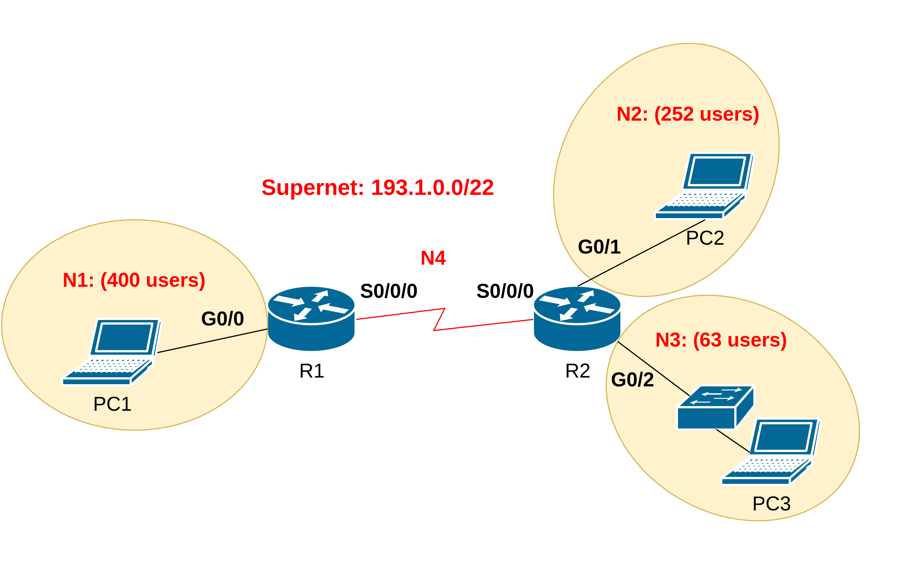
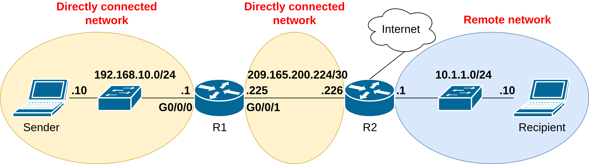
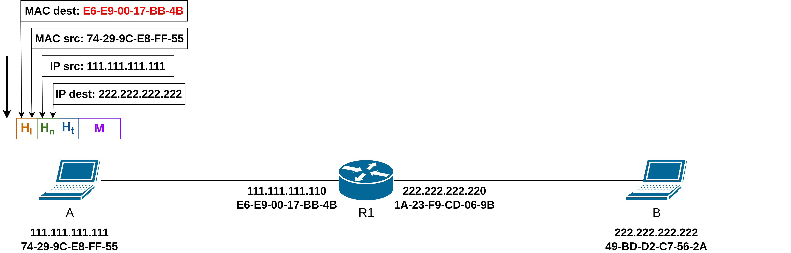
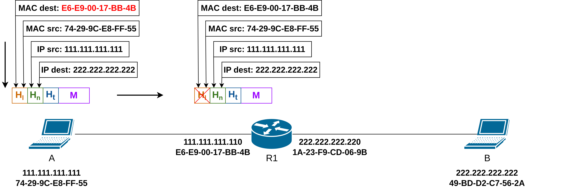
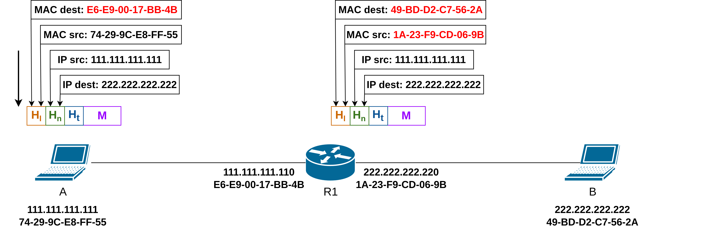
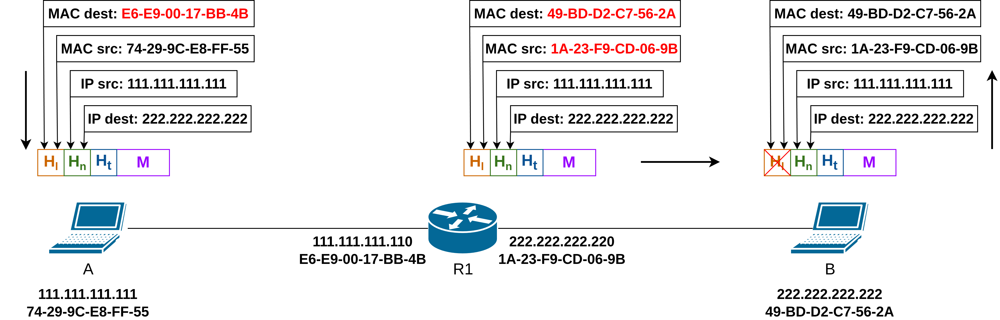

# Computer and Communication Networks: Network

Lecture 3

---
layout: default
---

# Content overview

- Recap
- Network Layer
- IPv4 Address
- Types of IPv4 Addresses
- Network Segmentation
- Variable Length Subnet Mask (VLSM)
- How a Host Routes
- Introduction to Routing
- ARP (Cont.)
- Network Address Translation (NAT)
---
layout: three-slots
---

# Recap: link layer services

::left::

- Framing and link access: wraps the datagram in a frame, manages access to a shared medium.
- Addressing: MAC addresses identify source and destination on the local link.
- Error detection: catches bit errors introduced by the physical medium.

::right::

---

# Recap: Ethernet

---

# Recap: MAC addresses and ARP

A MAC address identifies a device on the local link, flat and not tied to the network topology, unlike an IP address.

ARP maps an IP address to a MAC address, so a frame can actually be delivered on the LAN.

---
layout: section
---

# Network layer
---

# Services and protocols

IP provides services to allow end devices to exchange data.

Network layer protocols: IP version 4 (**IPv4**) and IP version 6 (**IPv6**).

The network layer performs operations:

<v-click>

- **Addressing** end devices
  - Every device on a network is assigned an IP address.
  - This IP address is logical, not tied to the hardware (unlike MAC at Layer 2).
  - It allows communication between networks (not just within the same LAN).
</v-click>
<v-click>

- **Encapsulation**
  - A sender encapsulates layer 4 segments into packets, passes to link layer.
  - IP can use either an IPv4 or IPv6 packet and not impact the layer 4 segment.
  - IP packet will be examined by all layer 3 devices as it traverses the network.
  - The IP addressing does not change from source to destination.

*Note: NAT will change addressing, but will be discussed in a later.*
</v-click>
---

# Services and protocols

The network layer performs operations:

<v-click>

- **De-encapsulation**
  - A receiver delivers packets to transport layer protocol.
</v-click>
<v-click>

- **Routing** (only router)
  - Determines the path packets take from source to destination using routing algorithms.
  - Analogy: taking a trip -> process of planning trip from source to destination.
</v-click>
<v-click>

- **Forwarding** (only router)
  - Moves packets from a device’s input interface to the appropriate output interface.
  - Analogy: taking a trip -> process of getting through single interchange.

Routing and forwarding work together: routing plans the whole trip in advance, forwarding executes one turn of it at a time, at every router along the way.
</v-click>
---

# Characteristics: connectionless

- IP does not establish a connection with the destination before sending the packet.
- There is no control information needed (synchronizations, acknowledgments, etc.).
- The destination will receive the packet when it arrives, but no pre-notifications are sent by IP.
- If there is a need for connection-oriented traffic, then another protocol will handle this (typically TCP at the transport layer).
---

# Characteristics: best effort

- IP will not guarantee delivery of the packet.
- IP has reduced overhead since there is no mechanism to resend data that is not received.
- IP does not expect acknowledgments.
- IP does not know if the other device is operational or if it received the packet.

This is the same tradeoff as connectionless delivery: IP stays simple and fast, and leaves reliability to a higher layer that actually needs it.
---

# Characteristics: media independent

IP is **unreliable**:
  - We've already seen why (connectionless, best effort). It relies on higher protocols like TCP when reliability actually matters.

IP is **media independent**:
  - IP does not concern itself with the type of frame required at the data link layer or the media type at the physical layer.
  - IP can be sent over any media type: copper, fiber, or wireless.
  - The **Maximum Transmission Unit** (MTU) is set by the data link layer below. Different media have different limits (e.g. Ethernet's 1500 bytes, which you already saw in the previous lecture).
  - In IPv4, if a packet is larger than the MTU of the link it needs to cross, it gets fragmented along the way. IPv6 handles this differently: routers never fragment. A router drops a packet that is too big and tells the source (ICMPv6 "Packet Too Big"), and the source sends smaller packets.
---

# IPv4 packet header format

---

# IPv4 packet header fields

- **Version** -> 4 bits, value 4 (0100) for IPv4.
- **Header Length** -> Header size in 32 bit words: 5 (20 bytes) without options, up to 15 (60 bytes) with them.
- **Type of Service (ToS)** -> QoS. Today Differentiated Services: 6 bit DSCP (priority) + 2 bit ECN (congestion).
- **Total Length** -> Size of the whole packet including header, max 65535 bytes.
- **Identification, Flags, Fragment Offset** -> Fragmentation: fragments share one ID, MF = more fragments follow, DF = don't fragment, offset = position for reassembly.
- **Time to Live (TTL)** -> Decremented by each router, packet dropped at 0, so it can't loop forever. The router then sends an ICMP Time Exceeded message back to the source, which is how `traceroute` works.
- **Protocol** -> Protocol in the payload: 1 = ICMP, 6 = TCP, 17 = UDP.
- **Header Checksum** -> Detects errors in the header only (unlike FCS at Layer 2, which covers the whole frame). Recomputed by every router, since TTL changes at each hop.
- **Source / Destination IPv4 Address** -> 32 bits each.
- **Options** -> Optional and rarely used (e.g. Record Route), extend the header beyond 20 bytes.
---
layout: section
---

# IPv4 address
---

# Network and host portions

An IPv4 address is a 32-bit hierarchical address that is made up of a network portion and a host portion.

A subnet mask is used to determine the network and host portions.

The subnet mask is compared to the IPv4 address bit for bit, from left to right.

---

# The prefix length

A prefix length is a less cumbersome method used to identify a subnet mask address.

The prefix length is the number of bits set to 1 in the subnet mask.

It is written in **"slash notation"** therefore, count the number of bits in the subnet mask and prepend it with **/** .

Example: 255.255.255.0 has 24 bits set to 1, so its prefix length is **/24**. Both notations describe the exact same mask.

---

# Network, host, and broadcast addresses

Within each network are three types of IP addresses:
- Network address: all host bits set to 0, identifies the network itself
- Host addresses: everything between the network and broadcast address, assignable to devices
- Broadcast address: all host bits set to 1, reaches every device on that network

---

# Unicast, broadcast, and multicast

Same three patterns you saw at Layer 2 with MAC addresses, now at Layer 3 with IP addresses.

- **Unicast:** one sender, one specific receiver
- **Broadcast:** one sender, every host on the local network (the .255 address you just saw)
- **Multicast:** one sender, a specific group of receivers who chose to join

---
layout: section
---

# Types of IPv4 addresses
---

# Assignment of IP addresses

The Internet Assigned Numbers Authority (IANA) manages and allocates blocks of IPv4 and IPv6 addresses to five Regional Internet Registries (RIRs). 

RIRs are responsible for allocating IP addresses to ISPs who provide IPv4 address blocks to smaller ISPs and organizations. 

---
layout: three-slots
---

# Legacy classful addressing

::left::

RFC 790 (1981) allocated IPv4 addresses in classes:
- Class **A (0.0.0.0/8 to 127.0.0.0/8)**
- Class **B (128.0.0.0 /16 - 191.255.0.0 /16)**
- Class **C (192.0.0.0 /24 - 223.255.255.0 /24)**
- Class **D (224.0.0.0 - 239.255.255.255)**
- Class **E (240.0.0.0 - 255.255.255.255)**

Classful addressing wasted many IPv4 addresses.

Classful address allocation was replaced with classless addressing which ignores the rules of classes (A, B, C). 

::right::

Class A -> networks: 128 and hosts: 16 777 214

Class B -> networks: 16 384 and hosts: 65 534

Class C -> networks: 2 097 152 and hosts: 254
---

# Public and private IPv4 addresses (RFC 1918)

**Public addresses** are globally routed between internet service provider (ISP) routers. 

**Private addresses:**
- used inside organizations for internal hosts.
- are not unique and can be used internally within any network
- are not globally routable

*Note: Private addresses are translated to public address (NAT), but will be discussed in a later.*

| Class | Network Address and Prefix | RFC 1918 Private Address Range |
|-------|----------------------------|--------------------------------|
| A     | 10.0.0.0/8                 | 10.0.0.0 – 10.255.255.255      |
| B     | 172.16.0.0/12              | 172.16.0.0 – 172.31.255.255    |
| C     | 192.168.0.0/16             | 192.168.0.0 – 192.168.255.255  |

---

# Special use IPv4 addresses

**Loopback addresses:**
- 127.0.0.0 /8 (127.0.0.1 to 127.255.255.254)
- Commonly identified as only 127.0.0.1
- Used on a host to test if TCP/IP is operational.

**Link-Local addresses:**
- 169.254.0.0 /16 (169.254.0.1 to 169.254.255.254)
- Commonly known as the Automatic Private IP Addressing (APIPA) addresses or self-assigned addresses. 
- Used by DHCP clients to self-configure when no DHCP server is available. This isn't Windows-specific, the underlying mechanism (RFC 3927) exists on macOS and Linux too.
- If a host has a 169.254.x.x address, that's a signal something's wrong. It never got a DHCP response, and without a real address it has no way to reach a default gateway either.
---
layout: section
---

# Network segmentation
---

# Broadcast domains and segmentation

Many protocols use broadcasts or multicasts (e.g., ARP use broadcasts to locate other devices, hosts send DHCP discover broadcasts to locate a DHCP server.)

Switches propagate broadcasts out all interfaces except the interface on which it was received. 

The only device that stops broadcasts is a router, because routers do not propagate broadcasts. 

Each router interface connects to a broadcast domain and broadcasts are only propagated within that specific broadcast domain.

*Note: This is similar to the collision domain concept from the previous lecture: a boundary that limits how far something can spread. A switch separates collision domains; a router separates broadcast domains.*

---
layout: three-slots
---

# Problems with large broadcast domains

::left::
A problem with a large broadcast domain is that every host has to process every broadcast, even ones meant for someone else. The more hosts, the more wasted work.

The solution is to reduce the size of the network to create smaller broadcast domains in a process called subnetting. 

Example:
- Dividing the network address 172.16.0.0 /16 into two subnets of 200 users each: 172.16.0.0 /24 and 172.16.1.0 /24.
  - Broadcasts are only propagated within the smaller broadcast domains. 

::right::

---

# Reasons for segmenting networks

Subnetting reduces overall network traffic and improves network performance.

It can be used to implement security policies between subnets: putting servers, guest devices, or sensitive systems in their own subnet makes it possible to control what can talk to what, instead of everything on one flat network being able to reach everything else.

Subnetting reduces the number of devices affected by abnormal broadcast traffic.

Subnets are used for a variety of reasons including by:
- location (e.g. floor...)
- group or function (e.g. administration, human resources, students, accounting...)
- device type (e.g. all hosts, all servers, all printers...)
---
layout: section
---

# Variable length subnet mask (VLSM)
---

# Example: topology

---

# Example: step 1
Determine the supernet range:

<v-click>

Let's identify the subnet mask needed for each network.
- What exactly do we need room for?
  - Every host, the router's own address on that subnet (default gateway (DGW), covered soon), the network address, the broadcast address
- **N1** + DGW + Network Address + Broadcast = 400 + 3 = 403 => 29 => 32-9 = **/23**
- **N2** + DGW + Network Address + Broadcast = 252 + 3 = 255 => 28 => 32-8 = **/24**
- **N3** + DGW + Network Address + Broadcast =  63 + 3 = 66  => 27 => 32-7 = **/25**
- **N4** (point-to-point) + Network Address + Broadcast =  2 + 2 = 4  => 22 => 32-2 = **/30**
</v-click>
---

# Example: step 2

Determine the N1 (400 hosts) range:

---

# Example: step 3

Determine the N2 (252 hosts) range:

---

# Example: step 4

Determine the N3 (63 hosts) range:

---

# Example: step 5

Determine the N4 (one P2P link) range:

---

# Example: summary
| Network | Network Address | Addresses | Usable hosts | Mask | Broadcast | Host Range|
|---------|-----------------|-----------|--------------|------|-----------|-----------|
| N1 | 193.1.0.0/23 | 512 | 510 | 255.255.254.0 | 193.1.1.255 | 193.1.0.1 - 193.1.1.254 |
| N2 | 193.1.2.0/24 | 256 | 254 | 255.255.255.0 | 193.1.2.255 | 193.1.2.1 - 193.1.2.254 |
| N3 | 193.1.3.0/25 | 128 | 126 | 255.255.255.128 | 193.1.3.127 | 193.1.3.1 - 193.1.3.126 |
| N4 | 193.1.3.128/30 | 4 | 2 | 255.255.255.252 | 193.1.3.131 | 193.1.3.129 - 193.1.3.130 |
---
layout: section
---

# How a host routes
---

# Host forwarding decision

Packets are always created at the source.

Each host device creates their own routing table.

A host can send packets to the following:
- Itself – 127.0.0.1 (IPv4), ::1 (IPv6)
- Local Hosts – destination is on the same LAN
- Remote Hosts – devices are not on the same LAN

---

# Host forwarding decision

The Source device determines whether the destination is local or remote.

Method of determination:

- IPv4 - Source uses its own IP address and Subnet mask, along with the destination IP address.
- Ipv6 - later.

Local traffic is sent directly to the destination host using its MAC address (via ARP), with no router involved.

Remote traffic is sent to the default gateway, which forwards the packet toward the destination network. Destination IP stays unchanged, but destination MAC becomes the default gateway's MAC.

---

# Default gateway

A router or layer 3 switch can be a default-gateway.

Features of a default gateway (DGW):

- It must have at least two interfaces.
- It must have an IP address in the same range as the rest of the LAN.
- It can accept data from the LAN and is capable of forwarding traffic off of the LAN.
- It can route to other networks.

If a device has no default gateway or a bad default gateway, its traffic will not be able to leave the LAN.
---

# A host routes to the default gateway

The host will know the default gateway  either statically or through DHCP in IPv4.

The default gateway is the next hop of the default route in the host's routing table.

The default route (0.0.0.0/0) is the last-resort route: it is used when no more specific route matches the destination.

All devices on the LAN need a default gateway if they intend to send traffic to remote networks.

---

# Host routing tables: Windows example

Real `netstat -r` output. Notice the default route (0.0.0.0/0) and the loopback entries (127.0.0.0/8) from what we just covered, now on a real machine.

---
layout: section
---

# Introduction to routing
---

# Router packet forwarding decision

What happens when the router receives the frame from the host device?
1. Packet arrives on the Gigabit Ethernet 0/0/0 interface of router R1. R1 de-encapsulates the Layer 2 Ethernet header and trailer.
2. Router R1 examines the destination IPv4 address of the packet and searches for the best match in its IPv4 routing table. The route entry indicates that this packet is to be forwarded to router R2.
3. Router R1 encapsulates the packet into a new Ethernet header and trailer, and forwards the packet to the next hop router R2.

---

# Router routing table: types of routes

**Directly Connected** - These routes are automatically added by the router, provided the interface is active and has addressing.

**Remote** - These are the routes the router does not have a direct connection and may be learned:
  - **Manually** - with a static route
  - **Dynamically** - by using a routing protocol to have the routers share their information with each other

**Default Route** - Same idea as the host's default route, but on the router: forwards traffic when nothing more specific matches in the table.

---

# Static routing

- Must be configured manually.
- Must be adjusted manually by the administrator when there is a change in the topology.
- Good for small non-redundant networks.
- Often used in conjunction with a dynamic routing protocol for configuring a default route.

---

# Dynamic routing

Dynamic Routes Automatically:
- Discover remote networks
- Maintain up-to-date information
- Choose the best path to the destination
- Find new best paths when there is a topology change

Dynamic routing can also share static default routes with the other routers.
---

# Example IPv4 routing table

The `show ip route` command shows the following route sources:
  - L – Local route to the router's own interface IP address
  - C – Directly connected network
  - S - Static route, manually configured by an administrator
  - O - OSPF, D - EIGRP (dynamic routing protocols, out of scope for this course)

---

# Longest prefix matching

A router picks the routing table entry with the longest matching prefix, not just any match.

| Network | Prefix length | Interface |
|---|---|---|
| 193.1.0.0/22 | 22 | Gi0/0 |
| 193.1.0.0/23 | 23 | Gi0/1 |
| 193.1.3.0/25 | 25 | Gi0/2 |

A packet for 193.1.0.5 matches the first two entries, /22 and /23, but not the third (that one's for a different subnet). Between the two matches, the router picks the longer one, /23, since it's the most specific match.

This is also why VLSM works at all: without longest prefix matching, a router couldn't tell a host route from the network route that contains it.

---
layout: section
---

# ARP (cont.)

Back in the link layer lecture, we promised to revisit ARP once we could route across subnets. Now we can.
---

# Routing to another subnet: addressing

walkthrough: **sending a packet from A to B via R**
- focus on addressing – at IP (packet) and MAC layer (frame) levels
- assume that:
  - A knows B’s IP address
  - A knows IP address of first hop router, R (from DHCP or static config, as we covered earlier)
  - A knows R’s MAC address (how?)

---

# Routing to another subnet: addressing

- A creates IP packet with IP source A, destination B 
- A creates link-layer frame containing A-to-B IP packet
  - **R's** MAC address is frame’s destination

---

# Routing to another subnet: addressing

- frame sent from A to R
- frame received at R, level 2 header removed, passed up to IP

---

# Routing to another subnet: addressing

- R determines outgoing interface, passes packet with IP source A, destination B to link layer 
- R creates link-layer frame containing A-to-B IP packet. Frame destination address: B's MAC address 
- transmits link-layer frame

*Note: R would learn B's MAC address the same way A learned R's, via ARP, not repeated here.*
---

# Routing to another subnet: addressing

- B receives frame, extracts IP packet destination B
- B passes packet up protocol stack to IP

---
layout: section
---

# Network address translation (NAT)

Private addresses aren't routable on the internet. NAT is how a whole private network still gets online through just one public address.
---
layout: three-slots
---
 
# NAT

**All devices** in local network share just **one IPv4 address** as far as outside world is concerned.

::left::
**All** packets **leaving** local network have **same** source NAT IP address: 138.76.29.7, but different source port numbers.

::right::
Packets with source or destination in this network have 192.168.0.0/24 address for  source, destination (as usual).
---

# NAT
All devices in local network have 32-bit addresses in a **private** IP address space (10/8, 172.16/12, 192.168/16) that can only be used in local network
advantages:
- just one IP address needed from provider ISP for all devices
- can change addresses of host in local network without notifying outside world
- can change ISP without changing addresses of devices in local network
- security: devices inside local net are not directly addressable or visible by outside world
---

# NAT with port rewriting (NAPT/PAT)

    
    
    
    

---

# NAT with port rewriting: implementation

The NAT router must do all of this **transparently** (neither side of the conversation notices that translation is happening, similar to how a switch is invisible to the hosts connected to it):

- **Outgoing packets:** replace the source IP address and source port of every outgoing packet with the NAT IP address and a new source port
  - Remote clients/servers will send their responses to the NAT IP address and new port
- **Remember the translation:** store each (source IP address, source port) to (NAT IP address, new port) mapping in the NAT translation table, so returning packets can be mapped back to the correct internal host and port
- **Incoming packets:** replace the destination IP address and destination port (NAT IP address, new port) with the corresponding internal IP address and port stored in the NAT translation table
---
layout: default
---

# Next lecture

- Transport Layer
- Reliable protocol
- UDP / TCP sockets

---

# References
1. Cisco Networking Academy. CCNA: Introduction to Networks.
2. KUROSE, James F. and ROSS, Keith W. Computer Networking: a Top Down Approach – authors' website. [online]. University of Massachusetts Amherst, 2025 [accessed 2025-09-03]. Available from: https://gaia.cs.umass.edu/kurose_ross/index.php

*Some slides and figures in this presentation are adapted from Kurose & Ross course materials.  
   © 1993–2025 J.F. Kurose and K.W. Ross. All rights reserved.*

Text and formatting were refined with AI assistance; all technical content was reviewed and verified by the author.