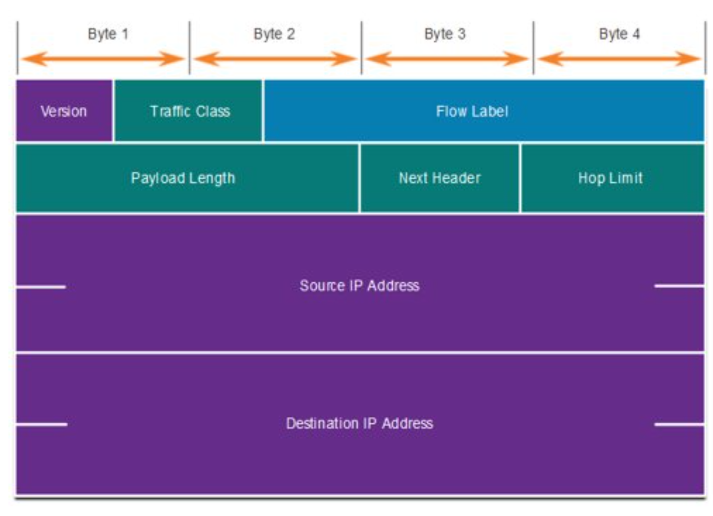
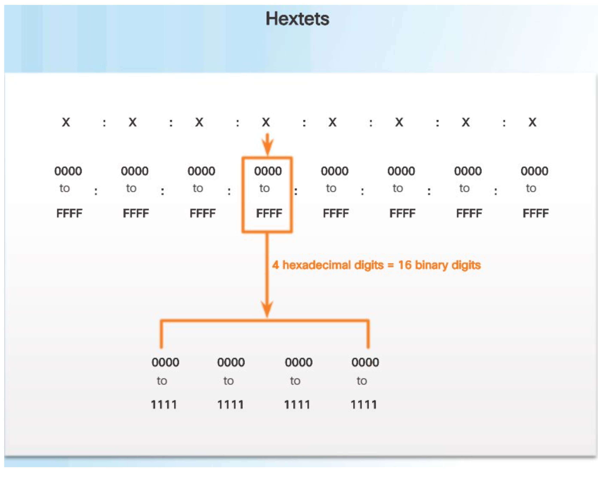
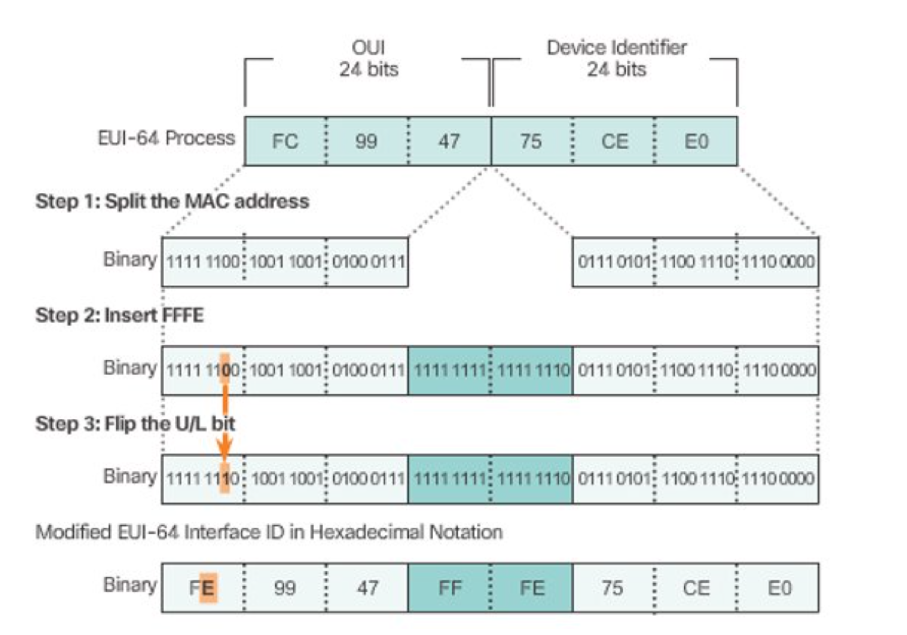
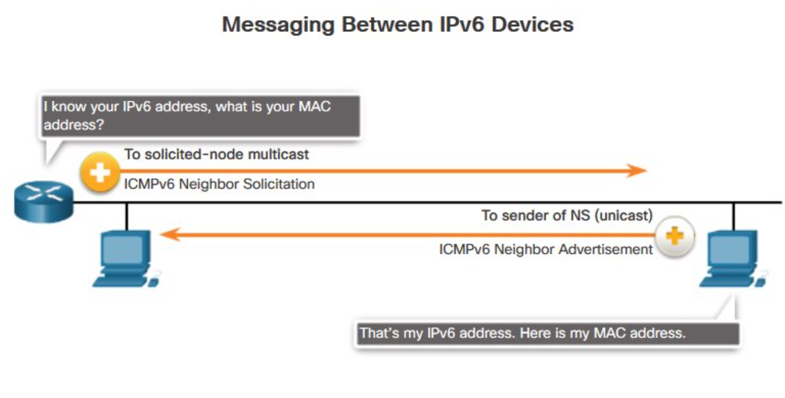
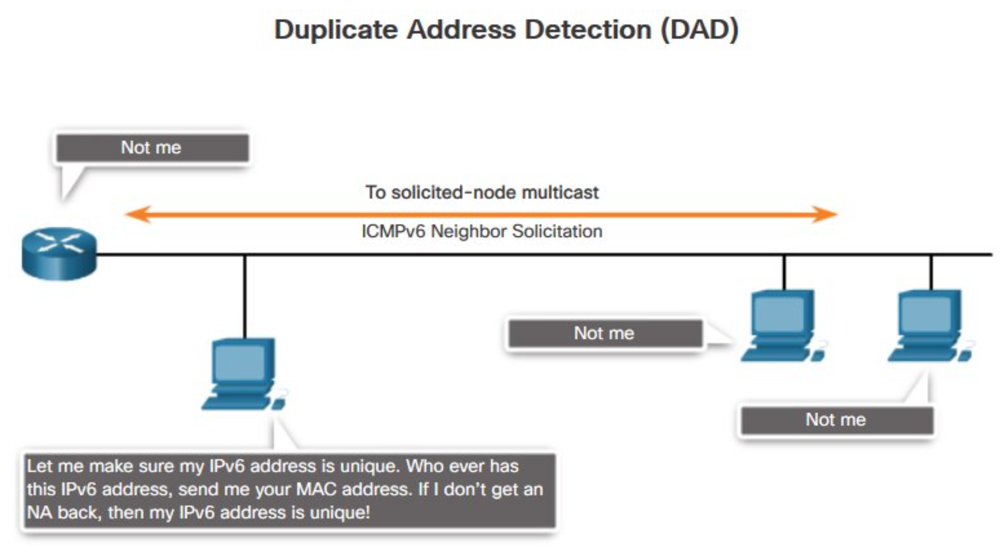
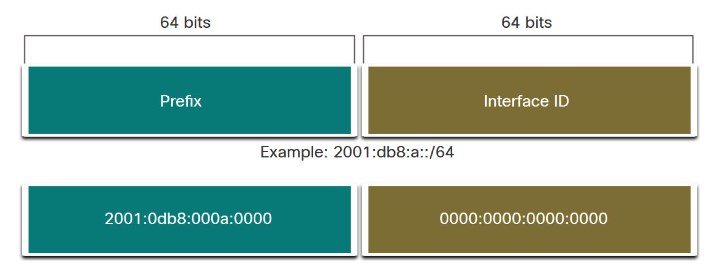
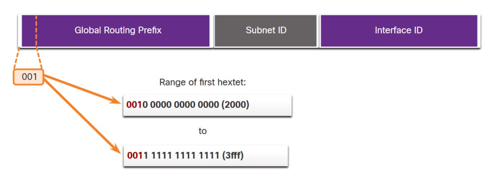
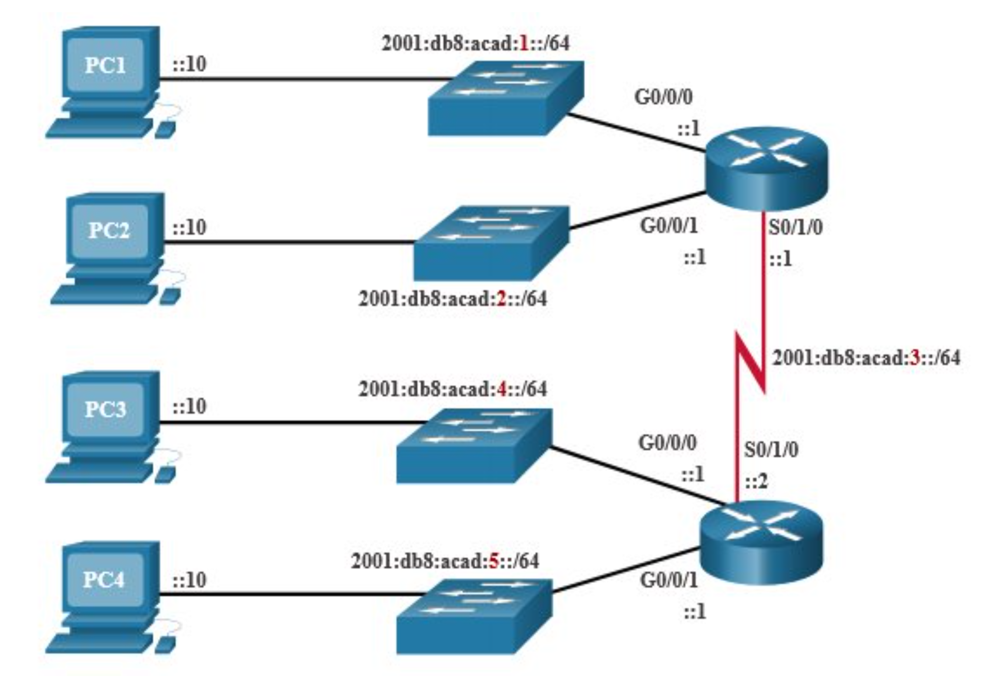
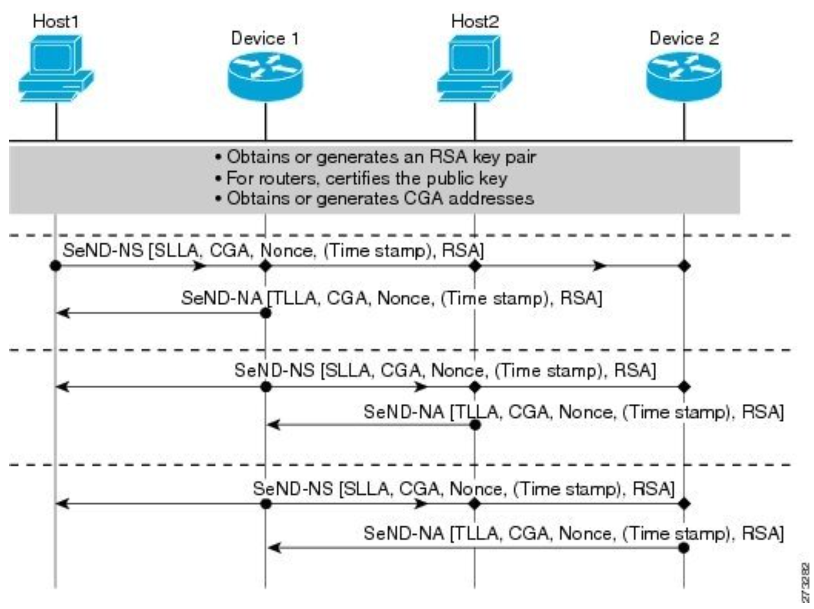

# Computer and Communication Networks : IPv6
Lecture 6

---
layout: default
---

# Content overview

- IPv6 packet structure​

- IPv4 issues​

- IPv6 addresses and ranges​

- Autoconfiguration and NDP​

- IPv6 subnetting​

- Coexistence of IPv4 and IPv6

---
layout: section
---

# IPv6

---
layout: three-slots
---

# IPv4 packet​

::left::
- Version = 0b0100​

- DS = Packet Priority (QoS)​

- TTL = limits number of hops between routers​

- Protocol = encapsulated protocol, e.g. TCP​

- Source IP Address = origin
node​

- Destination IP Address = target node​

::right::

---
layout: three-slots
---

# IPv6 packet​

::left::
- IPv6 packet simpler, not shorter​

- Fixed packet length 40B​

- 16B address​

- Some fields renamed​

- Removed from IPv4: ​
  - Flags​
  - Fragment Offset​
  - Header Checksum​

::right::

---
layout: three-slots
---

# IPv6 packet​

::left::
- Version = 0b0110​

- Traffic Class = Priority​

- Flow Label = enables packed processing based on flow ​

- Payload Length = Total Length in IPv4​

- Next Header = encapsulated protocol (Protocol in IPv4 )​

- Hop Limit = limits number of hops between routers (TTL in IPv4)​

::right::

---

# IPv4 issues​

- Not enough public IPv4 addresses (~4x10^9)​

- Increasing complexity of routing tables​

- Global reachability​

- NAT​

- IoT​

---

# IPv6​

- Larger address space (~340 x10^36)​

- Hierarchical addressing​

- NAT elimination​

- Simpler packet processing​

- E2E fragmentation = no intermediate device fragmentation​

- No broadcast

---

# IPv6 address

- Pv6 address 128b = 16B​

- Hexadecimal novation, “hextets“ separated by “:“ 
  - *​2001:0db8:0000:1111:0000:0000:0000:0200​*

- Short notations, observing 2 rules:​
  - Omit leading 0 in hextet ​
  - Double colon to replace one or more zero hextets  „::“​

---

# IPv6 address

---

# IPv6 address
- Full (prefered) notation​
  - 2001:0db8:0000:1111:0000:0000:0000:0200​

- Omit leading 0 in hextet​
  - 2001:db8:0:1111:0:0:0:200​

- Replace contiguous string of 0 - onlyonce within an address​
  - 2001:db8:0:1111::200

---

# IPv6 address

- What are the short notation of address?​
  - 2001:0db8:cafe:0000:0000:002e:0000:7334​
  
<v-click>

Solution​:
- 2001:db8:cafe:0:0:2e:0:7334​
- 2001:db8:cafe::2e:0:7334
</v-click>

<v-click>

Correct notation?​

- 2001:0db8:0000:00a3:abcd:0000:0000:1234​
- 2001:db8::a3:abcd::1234
</v-click>

<v-click>

Solution​
- No „::“ only once​
- 2001:db8:0:a3:abcd::1234
</v-click>
---

# IPv6 address

- Using IPv6 in URL inside “[]”​
  - https://[2001:db8:a3:abcd::1234]/​
  - 

- Notation including NIC identification ​
  - 2001:db8:a3:abcd::1234%2

---

# IPv6 address ranges​
- Unicast​
- Multicast​
- Anycast​

Each interface can have multiple IPv6 addresses, not just one as in IPv4.​
---

# IPv6 address ranges​

- Unicast​
  - Global Unicast Address (GUA) – most like public IPv4 address, globally unique, internet-routable.​
  - Link Local Address (LLA) – mandatory for each IPv6 enabled NIC, limited to single link, not routable ​
  - Unique Local Address (ULA) – rare, routable inside organization, similar to „private“ IPv4​
---
layout: three-slots
---

# IPv6 address ranges

::left::
- **Global Unicast Address** (GUA) 2000::/3​
- **Link Local Address** (LLA) fe80::/10(really fe80::/64)​
- **Loopback** ::1/128​
- **Unique Local Address** (ULA) fc00::/7​
- **Multicast address** ff00::/8(often ff02::/16)​

::right::

---
layout: three-slots
---

# IPv6 autoconfiguration​

::left::
- NIC ID​
  - Modified EUI-64​
  - Random​

- Stateless address autoconfiguration (SLAAC)

::right::

---

# IPv6 autoconfiguration​

- Considering number of addresses that 1 interface can have, manual configuration is not really feasible​
- Autoconfiguration as a replacement for DHCP from IPv4​
  - LLA address autoconfiguration​
  - GUA address autoconfiguration​
---

# IPv6 autoconfiguration​

- LLA address autoconfiguration (SLAAC)​
  - Link-local prefix FE80::/64​
  - NIC ID using Modified EUI-64 (or random)​

- Check potential conflicts using NDP Duplicate Address Detection

---

# IPv6 autoconfiguration​

- GUA address autoconfiguration ​
  - SLAAC (similar to LLA)​
    - Prefix from RA message​
    - NIC ID using Modified EUI-64 (or random)​
    - LLA of router from RA for default gateway​

- Check potential conflicts using NDP Duplicate Address Detection​
---

# IPv6 autoconfiguration​

- GUA address autoconfiguration ​
    - SLAAC & stateless DHCPv6​
      - SLAAC address from RA​
      - LLA of router from RA for default gateway​
      - DHCPv6 for everything else - DNS, NTP, ...​

- Check potential conflicts using NDP Duplicate Address Detection​
---

# IPv6 autoconfiguration​

- GUA address autoconfiguration ​
  - Statefull DHCPv6 – everything from DHCPv6 server​
  - Same as in DHCP for IPv4​
  - Process & Messagess:​
    - SOLICIT – multicast na ff02::1:2​
    - ADVERTISE​
    - REQUEST​
    - REPLY​

- Check potential conflicts using NDP Duplicate Address Detection​

---
layout: section
---

# Neigbor Discovery Protocol​ (NDP)
---

# NDP

- NDP similar function to ARP & ICMP in IPv4​

- NDP definuje 5 ICMPv6 správ, 4 dôležité pre IPv6 autokonfiguráciu ​
  - Router Solicitation​
  - Router Advertisement​
  - Neighbor Solicitation​
  - Neighbor Advertisement​
  - Redirect

----

# NDP

---

# NDP

---

# NDP

---
layout: section
---

# IPv6 Subnetting

----

# Subnetting​

- Trivial compared to IPv4​
- Recommendation to only subnet prefix /64

----

# Subnetting

- GUA subnetting​
  - Global routeing prefix (48b=6B)​
  - Subnet ID (16b=2B)​
  - Interface ID (64b=8B)

---

# Subnetting

2001:db8:acad::/48​

---

# Subnetting

Subnet 2001:db8:acad::/48​

---

# Subnetting

Is subnetting using only LLA possible?​

---

# IPv4 & IPv6 coexistence​

- IPv6 transition mechanisms:​
  - Dual stack – both IPv4 & IPv6 configured at the same time​
  - Tunneling – transport of IPv6 packets encapsulated in IPv4 packets over IPv4 network​
  - Translation – NAT64 similar to RFC1918 for private addresses in IPv4

---

# IPv6 security​

- Dual stack with no IPv6 rules for FW​
- NDP is easy to abuse​
- Local security (First hop)​
  - IPv6 Snooping / ND Inspection​
  - RA Guard​

- Replace NDP with Secure Neighbor Discovery (SEND)

---

# Send

---

# References
1. Cisco Networking Academy. CCNA: Introduction to Networks.
