# Computer and Communication Networks : Routing

Lecture 8

---
layout: default
---

# Content overview

- Defining the Routing Problem
- Destination-Based Forwarding
- Routing State Validity
- Least-Cost Routing
- Intra-Domain Routing
  - Static Routing
  - Link-State Routing Protocols
  - Distance-Vector Routing Protocols
- Inter-Domain Routing

---
layout: section
---

# Defining the Routing Problem

---

# Why Do We Need Routing? - Full Mesh Topology

If two machines need to communicate, we can simply connect them with a link.

<v-click>
What if we had 5 machines?
</v-click>
<v-click>

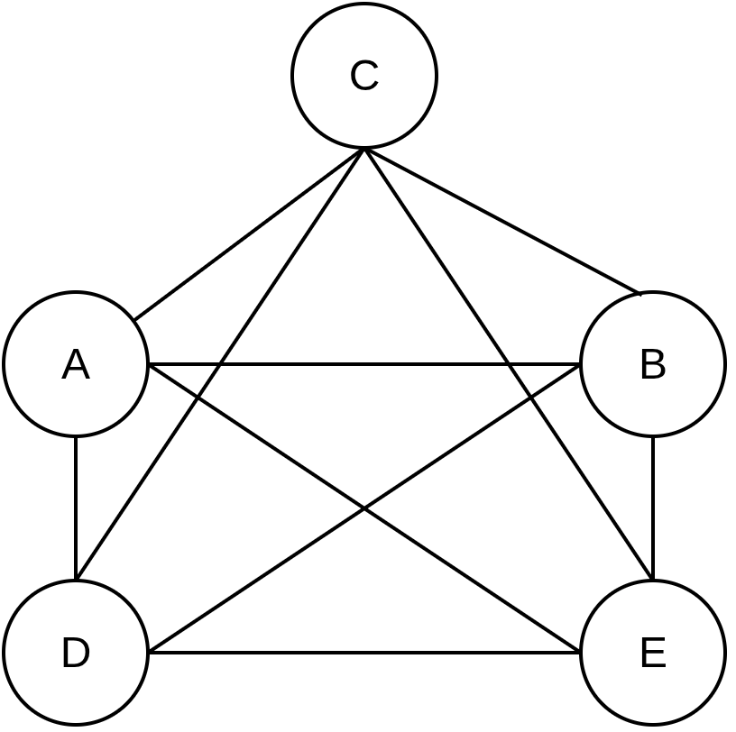

- We could add a link between every pair of machines.
  - The result is called a full-mesh topology.
</v-click>
<v-click>

- Problem: **It doesn’t scale - adding each new machine requires links to all existing machines.**
- Still useful in limited cases: provides dedicated, high-bandwidth links between every pair (e.g., HPC cluster).
</v-click>
---

# Why Do We Need Routing? - Single-Link Topology

Another approach: Use a single link (wire) to connect all 5 machines.
- Scales better than the full-mesh topology.
- Problem: **Less bandwidth available - all machines must share the link.**

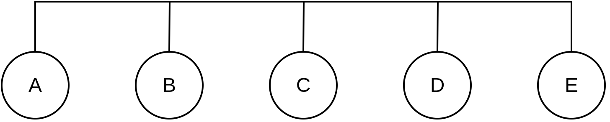
---

# Why Do We Need Routing? - Introducing Routers

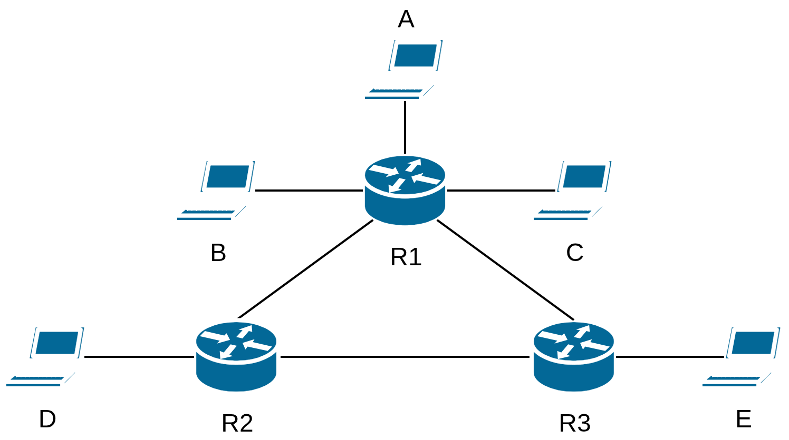

To use more sophisticated topologies, we need to introduce a **router**.
- Router: An intermediate machine that can forward data.

Benefits of using routers:
- reduces link count compared to full-mesh designs
- higher capacity than a single shared link
- alternate paths available if a link fails

Now we need a way to compute paths through the network - **routing protocols**!
---

# What Makes Routing Hard? - Changing Topologies

The network graph is constantly changing.
- Hosts join and leave the network.
- Links can fail, and new links can be added.

Routing protocol needs to be robust to changes.

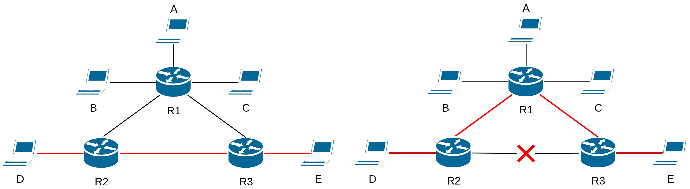
---

# What Makes Routing Hard? - Distributed Protocols


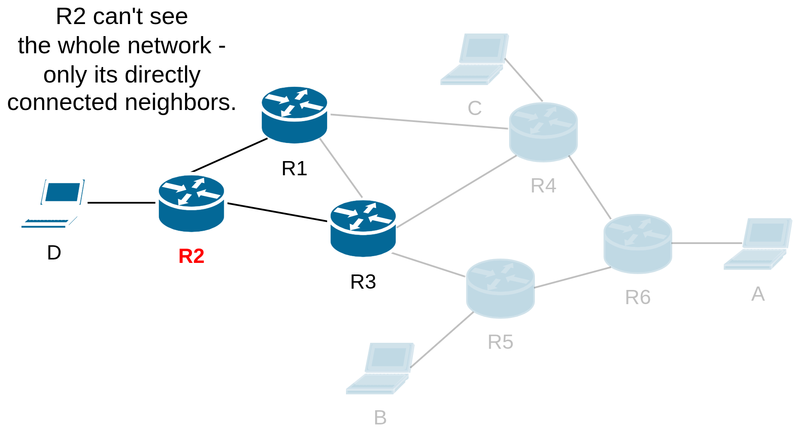

Routers do not have a global view of the network.
- A router only knows about itself and its direct neighbors.
- If a link fails, remote routers do not automatically know.

Routing must be done in a distributed way.
- There is no central controller computing all routes.
- Each router computes only its local piece of the routing solution.
- Routers must exchange information to build a consistent view of the network.
---

# What Makes Routing Hard? - Best-Effort

At Layer 3, delivery is best-effort, so packets may be dropped.

In summary, challenges of routing:
- Topology changes over time.
- Routers don't have a global view of the network.
- Best-effort delivery.
---

# Types of Routing Protocols

By Scope:

- **Intra-domain routing** protocols compute routes within a single network.
  - Sometimes called Interior Gateway Protocols (IGPs).

- **Inter-domain routing** protocols compute routes between networks.
  - Sometimes called Exterior Gateway Protocols (EGPs).

By How They Operate:
- **Distance-vector protocols**
  - Path-vector protocols (an extension of the distance-vector approach)
- **Link-state protocols**
---
layout: section
---

# Destination-Based Forwarding

---

# Routing Decisions

The basic challenge: When a packet arrives at a router, how does the router know where to send it next, such that it will eventually arrive at the desired destination?
- The **next hop** is where to forward the packet next.


---

# Routing Decisions

Some bad strategies:
- Send along a random link – bad because packet might not reach destination.
- Send along every link – bad because wasting bandwidth.


---

# Routing Decisions

The Internet uses **destination-based forwarding**.
- Each router keeps a table, mapping destinations to next hops.
- The decision only depends on the destination field of the packet.


---

# Routing Decisions


In practice, routing tables often specify physical ports rather than explicit next hops.

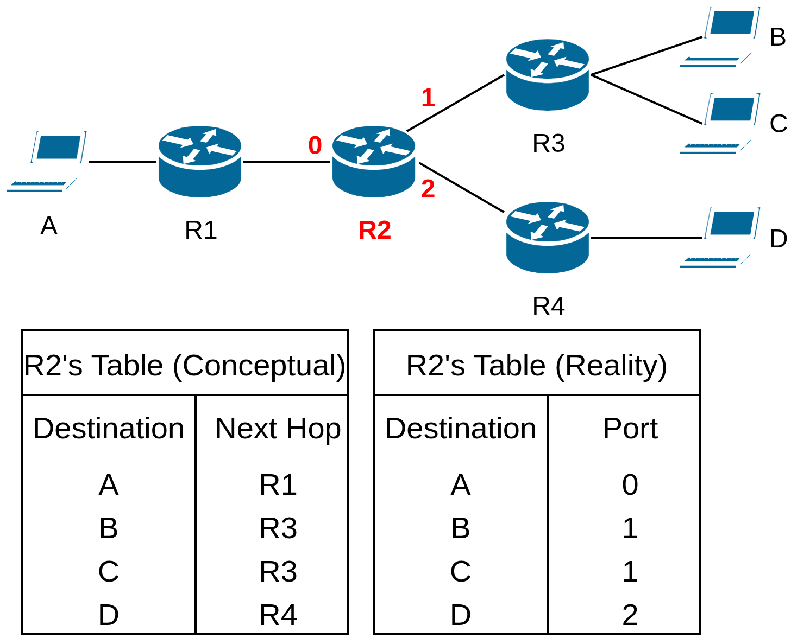

- Conceptual: "Send to next-hop of R3."
- Reality: "Send out of physical port 1."

For simplicity, we’ll use the conceptual view.
---
layout: three-slots
---

# Forwarding vs Routing

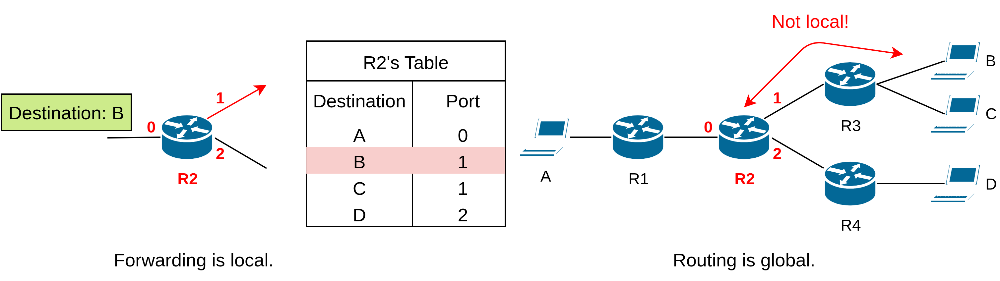

::left::
Forwarding:
- Look up the packet’s destination in the table and send the packet to the appropriate neighbor.
- Inherently local: depends only on the arriving packet and the router’s local forwarding table.
- Occurs every time a packet arrives (on the order of nanoseconds).

::right::
Routing:
- Communicates with other routers to determine how to populate routing tables.
- Inherently global: it must know about all reachable destinations, not only local ones.
- Is triggered whenever the network topology changes (e.g., when a link fails).
---
layout: section
---

# Routing State

---

  # When is routing state correct? 

  Routing state is considered correct if packets actually reach their intended destinations.
  - This concept applies only to the global (network-wide) routing state.

  A local routing state refers to the routing table within a single router.
  - You cannot determine the correctness of the overall routing state by examining only one router’s table in isolation.

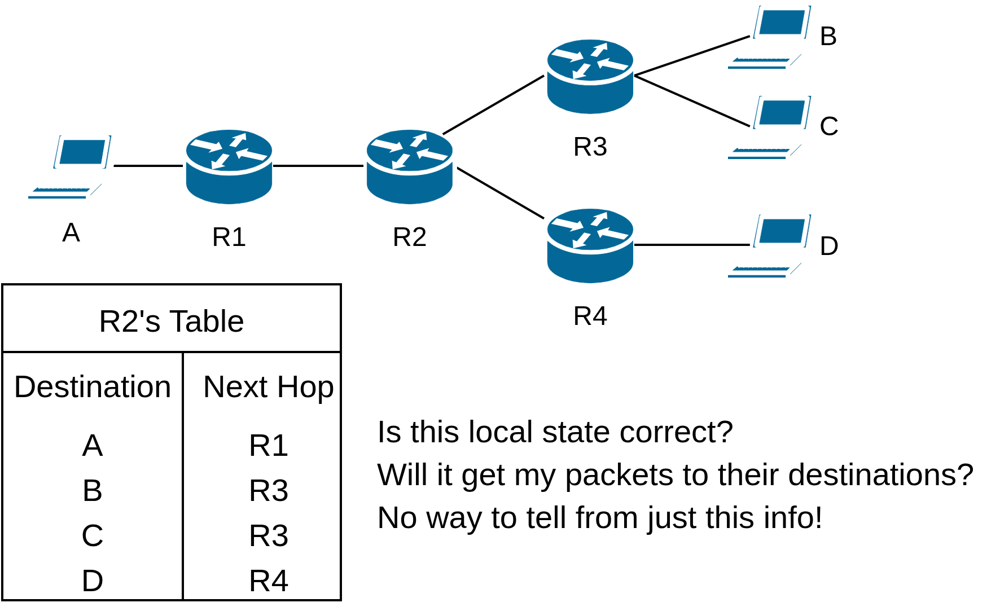
---

# When is routing state correct?

A global routing state refers to the collection of forwarding tables maintained by all routers in the network:
- Global state determines the paths a packet takes.
- Global state is valid if it produces forwarding decisions that deliver packets to their destinations.

Given a global state, how can you tell if it's correct?

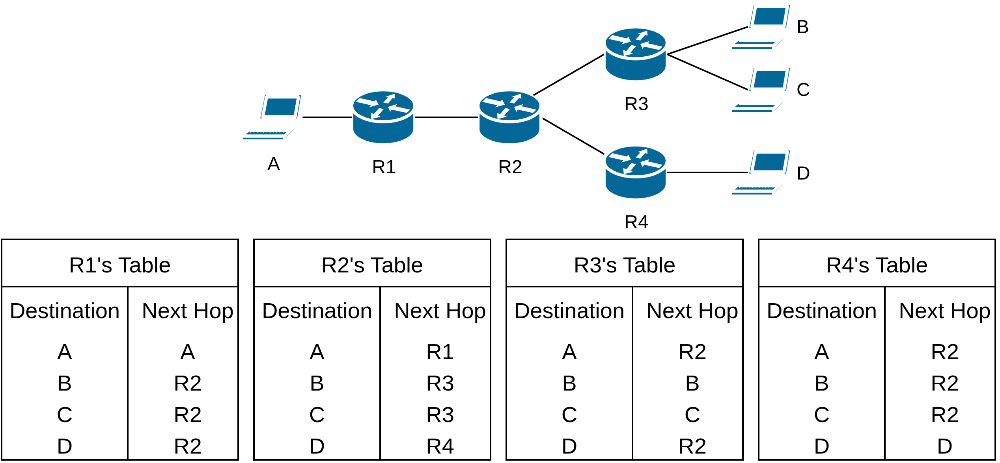
---

# Conditions

A global routing state is valid if and only if there are **no dead ends** and **no loops**.

**Dead end:** A packet arrives at a router, but there is no next hop to forward it.
- Packet arriving at destination doesn't count as a dead end.

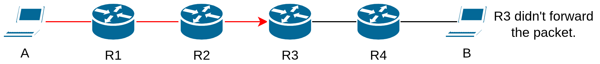

**Loop:** A packet cycles around the same set of routers.
- If forwarding only depends on destination field, if a packet gets stuck in a loop, it can never escape.

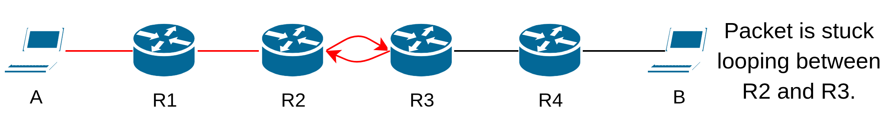
---

# Proof

A global routing state is correct (i.e. packets reach their destination)
*if and only if* there are no dead ends and no loops.
- To establish this, we must prove both directions: **necessary** and **sufficiency**.

Packets reach their destination only if there are no dead ends and loops (Necessary).

Proof:
- If you hit a dead end, you'll never reach the destination.
- If you get stuck in a loop, you'll never reach the destination.
  - In destination-based forwarding, no way to escape the loop.
  - Forwarding decision is the same every time the packet arrives at a router.
  - Destination isn't part of the loop. It wouldn't have forwarded the packet!
---

# Proof

*If* there are no dead ends and loops, packets will reach their destination (Sufficient).

Proof:
- Assume there are no loops and dead ends. Then:
  - Packet won't visit the same router twice (We said no loops).
  - Packet won't stop before hitting destination (We said no dead ends).
- Therefore:
  - Packet must keep wandering the network, visiting different routers.
  - There are only a finite number of unique routers to visit.
  - So the packet must eventually hit the destination.

We've proven both directions!
---

# Verifying routing state

A global routing state is correct if and only if there are no dead ends and no loops.

How do we apply this condition to check if a global state is valid?
- Strategy: Check each destination separately.
- For a given destination: Use the tables to see how each router forwards packets.
- The next-hop becomes an outgoing arrow.
- The result is a **directed delivery tree** for that destination.

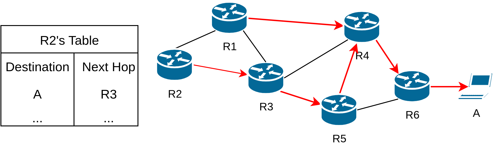
---

# Verifying routing state

A directed delivery tree shows how packets get forwarded toward one destination.

Properties of this tree (assuming one next hop per destination):
- Each router has one outgoing arrow (one next-hop entry per destination).
- If two paths merge at a router, they never split again, because that router always forwards packets for that destination to the same next hop.

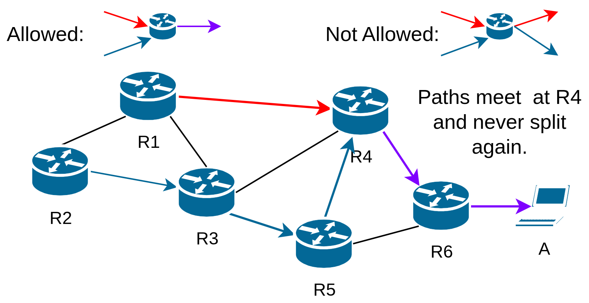
---

# Verifying routing state

A valid directed delivery tree is an **oriented spanning tree** rooted at the destination.
- **Oriented:** All edges have a direction (arrows).
- **Spanning:** Tree touches every node.
- **Tree:** There are no cycles and no disconnected components.
- **Rooted at the destination:** All edges point toward the destination router.

Starting at any node and following edges will reach the destination.

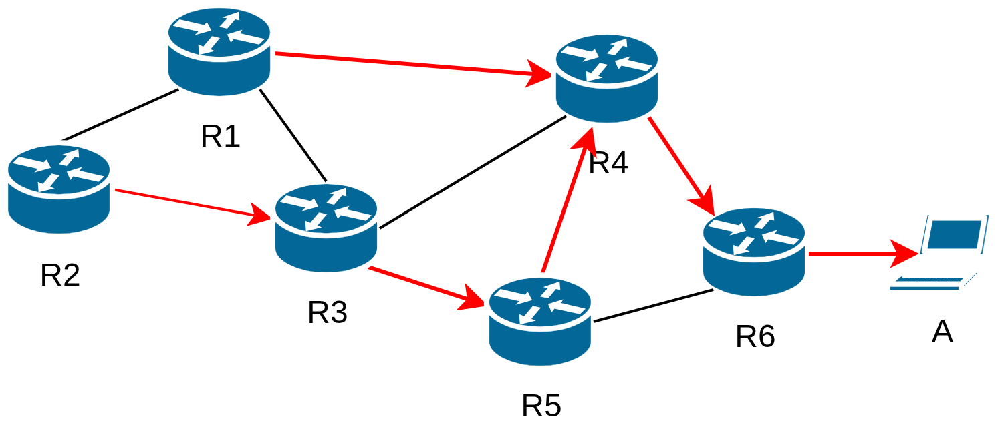
----

# Routing state - Examples

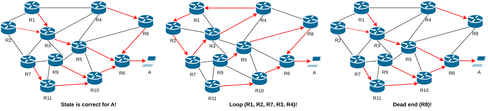

---
layout: section
---

# Least-Cost Routing

---

# Least-Cost Routing

We know what a correct routing state looks like (no loops, no dead ends).

But what makes one route better than another?

Common cost metrics:
- Price.
- Propagation delay.
- Distance.
- Unreliability.
- Bandwidth constraints.
---

# Least-Cost Routing – Definition

**Least-cost routing:** Assign costs to every edge, and find paths with lowest cost.
- Cost depends on the metric the operator wants to minimize.
- Costs can be arbitrary - routing protocols do not care where the costs come from.

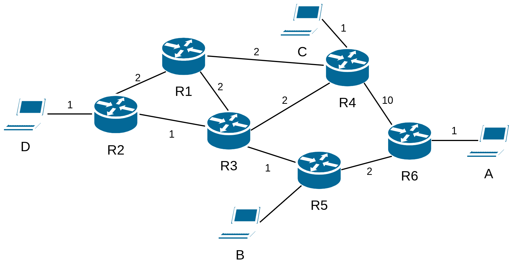
---

# Least-Cost Routing – Definition

In least-cost routing, routers should forward packets such that they take the lowest-cost path to the destination.

Example: If all costs are 1, the protocol finds paths with the fewest hops.
- Usually, if edges are unlabeled, assume they have cost 1.

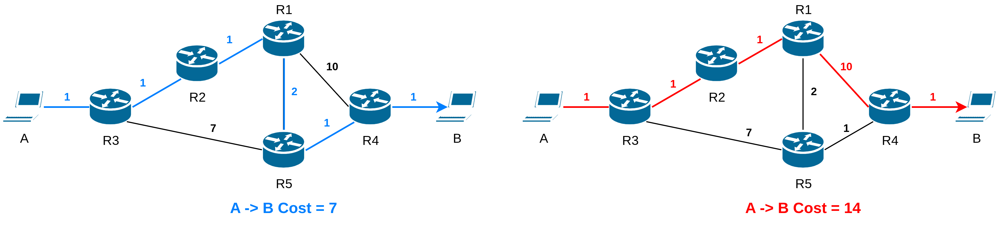
---

# Least-Cost Routing – Properties

Where do costs come from?
- Costs are **local** to each router: a router knows the costs of its directly connected links.
- In practice, these costs are usually **configured by a network operator**.
  - Some protocols allow for auto-configuration.

Properties of costs:
- Costs are always positive integers.
  - You cannot traverse an edge and make a path cheaper.
  - This aligns with essentially all practical metrics (delay, bandwidth, monetary cost, reliability, etc.).
- Costs are always symmetrical.
  - The cost from A → B equals the cost from B → A.
  - Exceptions possible in theory (e.g. different upload/download bandwidth).
- These two assumptions will simplify our protocols.
---

# Least-Cost Routing - Good Paths

What are good paths?
- **Path** - Sequence of routers a packet traverses from the source host to the destination host.
  - a valid path is any loop-free path that reaches the destination (no loops, no dead ends)
- **Good** - A path that is optimal according to the chosen metric (e.g., least cost, shortest, least congested).
  - all good paths are valid, but not all valid paths are good
---
layout: section
---

#  Intra-Domain Routing: Static Routing

---

# Static Routing

Some table entries can be manually configured rather than learned through a routing protocol.
- These routes are created when the operator manually configures the router.
- No routing protocol is needed to obtain or maintain these entries.
- The router does not need to be directly connected to the destination; the operator specifies the next hop explicitly.
- Remain in the routing table until explicitly removed (or the interface goes down).
- Example: 
    ```console
    Router(config)# ip route 0.0.0.0 0.0.0.0 192.168.1.1
    ```
---

# Hard-coded (Non-Dynamic) entries in routing table

**Connected (direct) routes:**  
- Automatically added by the router when an interface is configured and comes up.
- Represent networks that are **directly attached** to the router’s interfaces.  
- No manual destination entry needed - the router knows them because “I’m connected here”

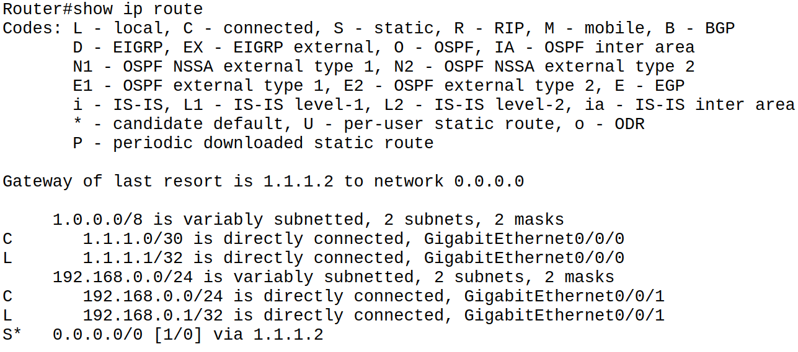

**Static routes:**  
- **Manually configured** by the network operator. 
- Explicitly "hard-coded" into the routing table  
- Can point to directly connected or remote (multi-hop) destinations.

---
layout: section
---

#  Intra-Domain Routing: Link-State Routing Protocols

---

# Link-State Protocols: Definition

- Centralized: network topology, link costs known to all nodes
  - accomplished via “link state broadcast”
  - all nodes have same info
- Computes least cost paths from one node (“source”) to all other nodes
  - gives forwarding table for that node
- Iterative: after *k* iterations, know least cost path to *k* destinations

Notation:
- *$c_{x,y}$*: direct link cost from node *x* to *y*; = ∞ if not direct neighbors
- *D(v)*: current estimate of cost of least-cost-path from source to destination v
- *p(v)*: predecessor node along path from source to v
- *N'*: set of nodes whose least-cost-path definitively known

---

# Dijkstra’s link-state routing algorithm

```text
Initialization:
    N' = {u} /* compute least cost path from u to all other nodes */
    for all nodes v
        if v adjacent to u /* u initially knows direct-path-cost only to direct neighbors */
            then D(v) = c_{u,v} /* but may not be minimum cost! */
        else D(v) = ∞

Loop:
    find w not in N' such that D(w) is a minimum
    add w to N'
    update D(v) for all v adjacent to w and not in N' :
        D(v) = min ( D(v), D(w) + c_{w,v} )
    /* new least-path-cost to v is either old least-cost-path to v or known
    least-cost-path to w plus direct-cost from w to v */
until all nodes in N'
```
---
layout: three-slots
---

# Dijkstra’s algorithm: an example

::left::
<div style="zoom: 0.75; display: inline-block;">

| <br>Step | <div style="width: 70px;"><div style="width: 70px;"><br>N'</div> </div> | <span class="text-red-600 font-bold">V</span><br>D(v),p(v) | <span class="text-red-600 font-bold">W</span><br>D(w),p(w) | <span class="text-red-600 font-bold">X</span><br>D(x),p(x) | <span class="text-red-600 font-bold">Y</span><br>D(y),p(y) | <span class="text-red-600 font-bold">Z</span><br>D(z),p(z) |
|---------|---------|---------|---------|---------|---------|---------|
| 0 | u    | 2,u | 5,u | 1,u | ∞ | ∞ |
| 1 |||||||
| 2 |||||||
| 3 |||||||
| 4 |||||||
| 5 |||||||

</div>


::right::
<div style="zoom: 1.0; display: inline-block;">

```text
Initialization (step 0):
    For all a: if a adjacent to u then D(a) = C_{u,a}
``` 
</div>

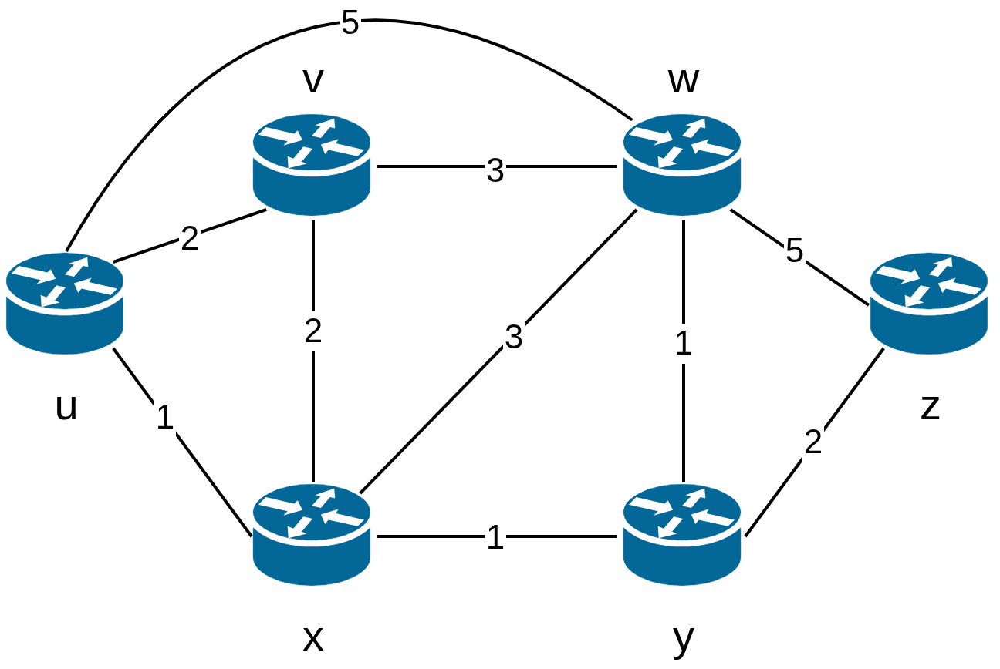

---
layout: three-slots
---

# Dijkstra’s algorithm: an example

::left::
<div style="zoom: 0.75; display: inline-block;">

| <br>Step | <div style="width: 70px;"><div style="width: 70px;"><br>N'</div> </div> | <span class="text-red-600 font-bold">V</span><br>D(v),p(v) | <span class="text-red-600 font-bold">W</span><br>D(w),p(w) | <span class="text-red-600 font-bold">X</span><br>D(x),p(x) | <span class="text-red-600 font-bold">Y</span><br>D(y),p(y) | <span class="text-red-600 font-bold">Z</span><br>D(z),p(z) |
|---------|---------|---------|---------|---------|---------|---------|
| 0 | u | 2,u | 5,u | <mark style="background:lightcoral;">1,u</mark> | ∞ | ∞ |
| 1 | u<span class="text-red-600 font-bold">x</span> ||||||
| 2 |  |  |  |  |  |  |
| 3 |  |  |  |  |  |  |
| 4 |  |  |  |  |  |  |
| 5 |  |  |  |  |  |  |

</div>


::right::
<div style="zoom: 1.0; display: inline-block;">

```text
Loop
 find a not in N' such that D(a) is a minimum
 add a to N'
```

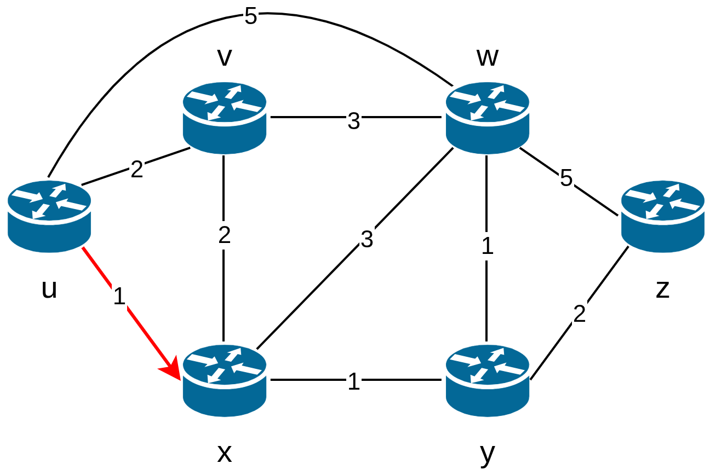

</div>

---
layout: three-slots
---

# Dijkstra’s algorithm: an example

::left::
<div style="zoom: 0.75; display: inline-block;">

| <br>Step | <div style="width: 70px;"><br>N'</div>  | <span class="text-red-600 font-bold">V</span><br>D(v),p(v) | <span class="text-red-600 font-bold">W</span><br>D(w),p(w) | <span class="text-red-600 font-bold">X</span><br>D(x),p(x) | <span class="text-red-600 font-bold">Y</span><br>D(y),p(y) | <span class="text-red-600 font-bold">Z</span><br>D(z),p(z) |
|---------|---------|---------|---------|---------|---------|---------|
| 0 | u | 2,u | 5,u | <mark style="background:lightcoral;">1,u</mark> | ∞ | ∞ |
| 1 | ux | 2,u | 4,x || 2,x| ∞ |
| 2 |  |  |  |  |  |  |
| 3 |  |  |  |  |  |  |
| 4 |  |  |  |  |  |  |
| 5 |  |  |  |  |  |  |

</div>


::right::
<div style="zoom: 1.0; display: inline-block;">

```text
Loop
 find a not in N' such that D(a) is a minimum
 add a to N'
 update D(b) for all b adjacent to a and not in N':
  D(b) = min ( D(b), D(a) + c_{a,b} )
``` 
</div>

D(v) = min ( D(v), D(x) + c$_{x,v}$) = min(2, 1+2) = 2

D(w) = min ( D(w), D(x) + c$_{x,w}$) = min (5, 1+3) = 4

D(y) = min ( D(y), D(x) + c$_{x,y}$) = min(inf, 1+1) = 2


---
layout: three-slots
---

# Dijkstra’s algorithm: an example

::left::
<div style="zoom: 0.75; display: inline-block;">

| <br>Step | <div style="width: 70px;"><br>N'</div>  | <span class="text-red-600 font-bold">V</span><br>D(v),p(v) | <span class="text-red-600 font-bold">W</span><br>D(w),p(w) | <span class="text-red-600 font-bold">X</span><br>D(x),p(x) | <span class="text-red-600 font-bold">Y</span><br>D(y),p(y) | <span class="text-red-600 font-bold">Z</span><br>D(z),p(z) |
|---------|---------|---------|---------|---------|---------|---------|
| 0 | u | 2,u | 5,u | <mark style="background:lightcoral;">1,u</mark> | ∞ | ∞ |
| 1 | ux | 2,u | 4,x || <mark style="background:lightcoral;">2,x</mark> | ∞ |
| 2 | ux<span class="text-red-600 font-bold">y</span> |  |  |  |  |  |
| 3 |  |  |  |  |  |  |
| 4 |  |  |  |  |  |  |
| 5 |  |  |  |  |  |  |

</div>


::right::
<div style="zoom: 1.0; display: inline-block;">

```text
Loop
 find a not in N' such that D(a) is a minimum
 add a to N'
``` 


</div>
---
layout: three-slots
---

# Dijkstra’s algorithm: an example

::left::
<div style="zoom: 0.75; display: inline-block;">

| <br>Step | <div style="width: 70px;"><br>N'</div>  | <span class="text-red-600 font-bold">V</span><br>D(v),p(v) | <span class="text-red-600 font-bold">W</span><br>D(w),p(w) | <span class="text-red-600 font-bold">X</span><br>D(x),p(x) | <span class="text-red-600 font-bold">Y</span><br>D(y),p(y) | <span class="text-red-600 font-bold">Z</span><br>D(z),p(z) |
|---------|---------|---------|---------|---------|---------|---------|
| 0 | u | 2,u | 5,u | <mark style="background:lightcoral;">1,u</mark> | ∞ | ∞ |
| 1 | ux | 2,u | 4,x || <mark style="background:lightcoral;">2,x</mark> | ∞ |
| 2 | uxy | 2,u | 3,y |  |  | 4,y |
| 3 |  |  |  |  |  |  |
| 4 |  |  |  |  |  |  |
| 5 |  |  |  |  |  |  |

</div>


::right::
<div style="zoom: 1.0; display: inline-block;">

```text
Loop
 find a not in N' such that D(a) is a minimum
 add a to N'
 update D(b) for all b adjacent to a and not in N':
  D(b) = min ( D(b), D(a) + c_{a,b} )
``` 
</div>

D(w) = min ( D(w), D(y) + c$_{y,w}$) = min (4, 2+1) = 3

D(z) = min ( D(z), D(y) + c$_{y,z}$) = min(inf, 2+2) = 4


---
layout: three-slots
---

# Dijkstra’s algorithm: an example

::left::
<div style="zoom: 0.75; display: inline-block;">

| <br>Step | <div style="width: 70px;"><br>N'</div>  | <span class="text-red-600 font-bold">V</span><br>D(v),p(v) | <span class="text-red-600 font-bold">W</span><br>D(w),p(w) | <span class="text-red-600 font-bold">X</span><br>D(x),p(x) | <span class="text-red-600 font-bold">Y</span><br>D(y),p(y) | <span class="text-red-600 font-bold">Z</span><br>D(z),p(z) |
|---------|---------|---------|---------|---------|---------|---------|
| 0 | u | 2,u | 5,u | <mark style="background:lightcoral;">1,u</mark> | ∞ | ∞ |
| 1 | ux | 2,u | 4,x || <mark style="background:lightcoral;">2,x</mark> | ∞ |
| 2 | uxy | <mark style="background:lightcoral;">2,u</mark> | 3,y |  |  | 4,y |
| 3 | uxy<span class="text-red-600 font-bold">v</span> |  |  |  |  |  |
| 4 |  |  |  |  |  |  |
| 5 |  |  |  |  |  |  |

</div>


::right::
<div style="zoom: 1.0; display: inline-block;">

```text
Loop
 find a not in N' such that D(a) is a minimum
 add a to N'
``` 
</div>

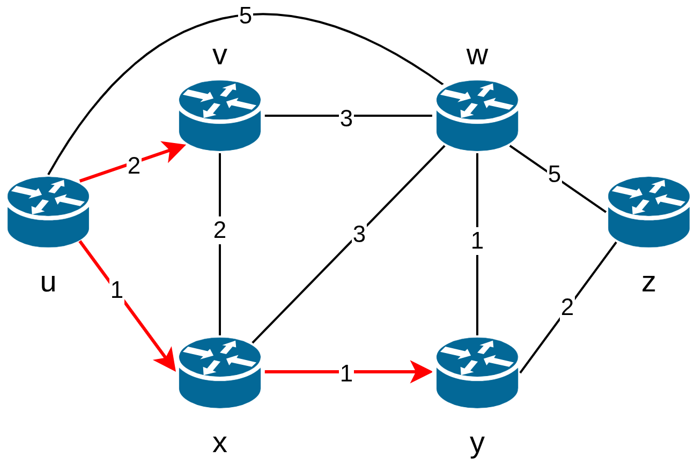

---
layout: three-slots
---

# Dijkstra’s algorithm: an example

::left::
<div style="zoom: 0.75; display: inline-block;">

| <br>Step | <div style="width: 70px;"><br>N'</div>  | <span class="text-red-600 font-bold">V</span><br>D(v),p(v) | <span class="text-red-600 font-bold">W</span><br>D(w),p(w) | <span class="text-red-600 font-bold">X</span><br>D(x),p(x) | <span class="text-red-600 font-bold">Y</span><br>D(y),p(y) | <span class="text-red-600 font-bold">Z</span><br>D(z),p(z) |
|---------|---------|---------|---------|---------|---------|---------|
| 0 | u | 2,u | 5,u | <mark style="background:lightcoral;">1,u</mark> | ∞ | ∞ |
| 1 | ux | 2,u | 4,x || <mark style="background:lightcoral;">2,x</mark> | ∞ |
| 2 | uxy | <mark style="background:lightcoral;">2,u</mark> | 3,y |  |  | 4,y |
| 3 | uxyv |  | 3,y |  |  | 4,y |
| 4 |  |  |  |  |  |  |
| 5 |  |  |  |  |  |  |

</div>


::right::
<div style="zoom: 1.0; display: inline-block;">

```text
Loop
 find a not in N' such that D(a) is a minimum
 add a to N'
 update D(b) for all b adjacent to a and not in N':
  D(b) = min ( D(b), D(a) + c_{a,b} )
``` 
</div>

D(w) = min ( D(w), D(v) + c$_{v,w}$) = min (3, 2+3) = 3


---
layout: three-slots
---

# Dijkstra’s algorithm: an example

::left::
<div style="zoom: 0.75; display: inline-block;">

| <br>Step | <div style="width: 70px;"><br>N'</div>  | <span class="text-red-600 font-bold">V</span><br>D(v),p(v) | <span class="text-red-600 font-bold">W</span><br>D(w),p(w) | <span class="text-red-600 font-bold">X</span><br>D(x),p(x) | <span class="text-red-600 font-bold">Y</span><br>D(y),p(y) | <span class="text-red-600 font-bold">Z</span><br>D(z),p(z) |
|---------|---------|---------|---------|---------|---------|---------|
| 0 | u | 2,u | 5,u | <mark style="background:lightcoral;">1,u</mark> | ∞ | ∞ |
| 1 | ux | 2,u | 4,x || <mark style="background:lightcoral;">2,x</mark> | ∞ |
| 2 | uxy | <mark style="background:lightcoral;">2,u</mark> | 3,y |  |  | 4,y |
| 3 | uxyv |  | <mark style="background:lightcoral;">3,y</mark> |  |  | 4,y |
| 4 | uxyv<span class="text-red-600 font-bold">w</span> |  |  |  |  |  |
| 5 |  |  |  |  |  |  |

</div>


::right::
<div style="zoom: 1.0; display: inline-block;">

```text
Loop
 find a not in N' such that D(a) is a minimum
 add a to N'
``` 
</div>

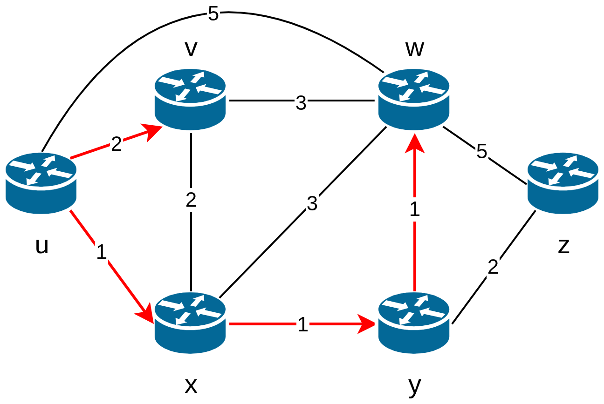

---
layout: three-slots
---

# Dijkstra’s algorithm: an example

::left::
<div style="zoom: 0.75; display: inline-block;">

| <br>Step | <div style="width: 70px;"><br>N'</div>  | <span class="text-red-600 font-bold">V</span><br>D(v),p(v) | <span class="text-red-600 font-bold">W</span><br>D(w),p(w) | <span class="text-red-600 font-bold">X</span><br>D(x),p(x) | <span class="text-red-600 font-bold">Y</span><br>D(y),p(y) | <span class="text-red-600 font-bold">Z</span><br>D(z),p(z) |
|---------|---------|---------|---------|---------|---------|---------|
| 0 | u | 2,u | 5,u | <mark style="background:lightcoral;">1,u</mark> | ∞ | ∞ |
| 1 | ux | 2,u | 4,x || <mark style="background:lightcoral;">2,x</mark> | ∞ |
| 2 | uxy | <mark style="background:lightcoral;">2,u</mark> | 3,y |  |  | 4,y |
| 3 | uxyv |  | <mark style="background:lightcoral;">3,y</mark> |  |  | 4,y |
| 4 | uxyvw |  |  |  |  | 4,y |
| 5 |  |  |  |  |  |  |

</div>

::right::
<div style="zoom: 1.0; display: inline-block;">

```text
Loop
 find a not in N' such that D(a) is a minimum
 add a to N'
 update D(b) for all b adjacent to a and not in N':
  D(b) = min ( D(b), D(a) + c_{a,b} )
``` 
</div>

D(z) = min ( D(z), D(w) + c$_{w,z}$) = min (4, 3+5) = 4


---
layout: three-slots
---

# Dijkstra’s algorithm: an example

::left::
<div style="zoom: 0.75; display: inline-block;">

| <br>Step | <div style="width: 70px;"><br>N'</div>  | <span class="text-red-600 font-bold">V</span><br>D(v),p(v) | <span class="text-red-600 font-bold">W</span><br>D(w),p(w) | <span class="text-red-600 font-bold">X</span><br>D(x),p(x) | <span class="text-red-600 font-bold">Y</span><br>D(y),p(y) | <span class="text-red-600 font-bold">Z</span><br>D(z),p(z) |
|---------|---------|---------|---------|---------|---------|---------|
| 0 | u | 2,u | 5,u | <mark style="background:lightcoral;">1,u</mark> | ∞ | ∞ |
| 1 | ux | 2,u | 4,x || <mark style="background:lightcoral;">2,x</mark> | ∞ |
| 2 | uxy | <mark style="background:lightcoral;">2,u</mark> | 3,y |  |  | 4,y |
| 3 | uxyv |  | <mark style="background:lightcoral;">3,y</mark> |  |  | 4,y |
| 4 | uxyvw |  |  |  |  | <mark style="background:lightcoral;">4,y</mark> |
| 5 | uxyvwv<span class="text-red-600 font-bold">z</span> |  |  |  |  |  |

</div>

::right::
<div style="zoom: 1.0; display: inline-block;">

```text
Loop
 find a not in N' such that D(a) is a minimum
 add a to N'
``` 

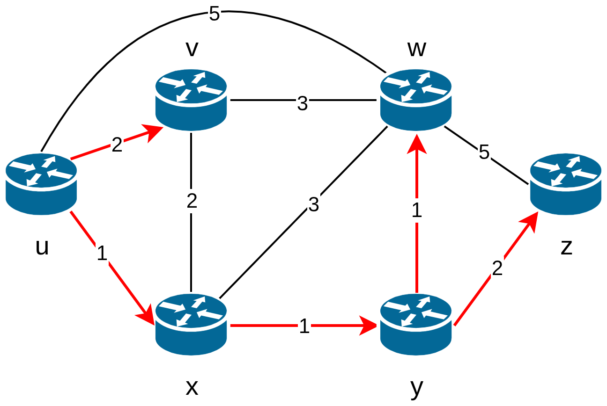

</div>

---
layout: three-slots
---

# Dijkstra’s algorithm: an example

::left::
<div style="zoom: 0.75; display: inline-block;">

| <br>Step | <div style="width: 70px;"><br>N'</div>  | <span class="text-red-600 font-bold">V</span><br>D(v),p(v) | <span class="text-red-600 font-bold">W</span><br>D(w),p(w) | <span class="text-red-600 font-bold">X</span><br>D(x),p(x) | <span class="text-red-600 font-bold">Y</span><br>D(y),p(y) | <span class="text-red-600 font-bold">Z</span><br>D(z),p(z) |
|---------|---------|---------|---------|---------|---------|---------|
| 0 | u | 2,u | 5,u | <mark style="background:lightcoral;">1,u</mark> | ∞ | ∞ |
| 1 | ux | 2,u | 4,x || <mark style="background:lightcoral;">2,x</mark> | ∞ |
| 2 | uxy | <mark style="background:lightcoral;">2,u</mark> | 3,y |  |  | 4,y |
| 3 | uxyv |  | <mark style="background:lightcoral;">3,y</mark> |  |  | 4,y |
| 4 | uxyvw |  |  |  |  | <mark style="background:lightcoral;">4,y</mark> |
| 5 | uxyvwvz |  |  |  |  |  |

</div>

::right::
<div style="zoom: 1.0; display: inline-block;">

```text
Loop
 find a not in N' such that D(a) is a minimum
 add a to N'
 update D(b) for all b adjacent to a and not in N':
  D(b) = min ( D(b), D(a) + c_{a,b} )
``` 
</div>


---
layout: three-slots
---

# Dijkstra’s algorithm: an example


::left::
resulting **least-cost-path tree** from *u* :

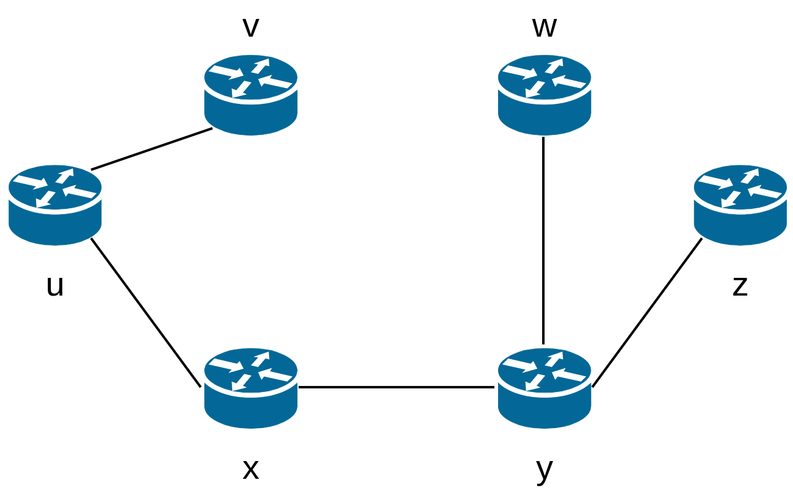

::right::
resulting **forwarding table** in *u* :

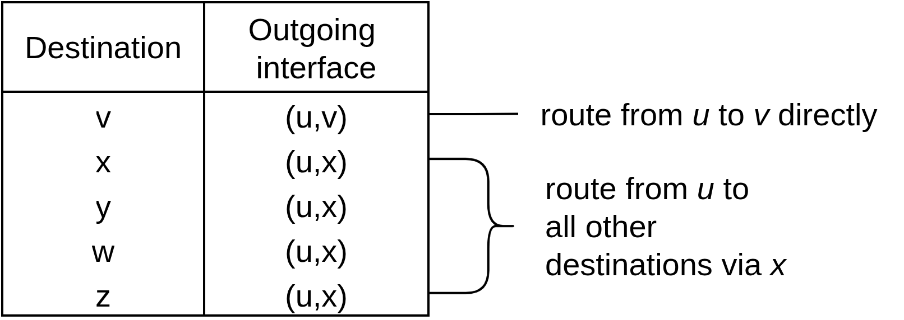

---

# Dijkstra’s algorithm: discussion

**Algorithm complexity:** *n* nodes
- each of *n* iteration: need to check all nodes, *w*, not in *N*
- *n(n+1)/2* comparisons: O(n$^2$) complexity
- more efficient implementations possible: O(nlogn)

**Message complexity:**
- each router must broadcast its link state information to other *n* routers 
- efficient (and interesting!) broadcast algorithms: O(n) link crossings to disseminate a broadcast message from one source
- each router’s message crosses O(n) links: overall message complexity: O(n$^2$)

---
layout: section
---

# Intra-Domain Routing: Distance-Vector Routing Protocols 

---

# Algorithm Sketch

<div class="relative h-100">
    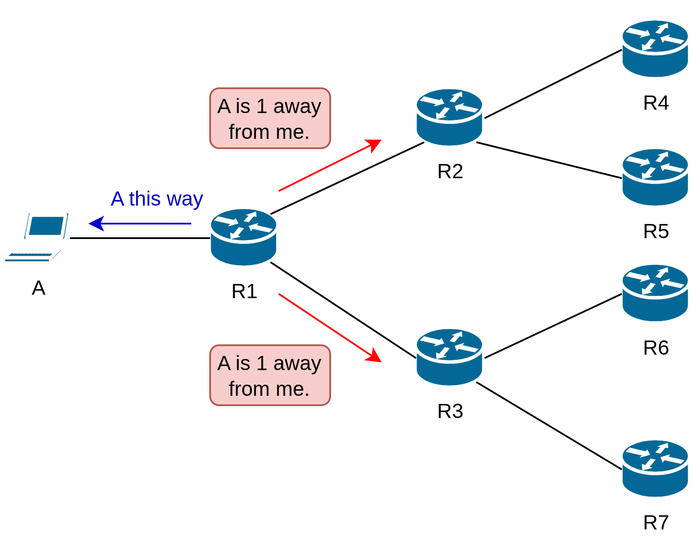
    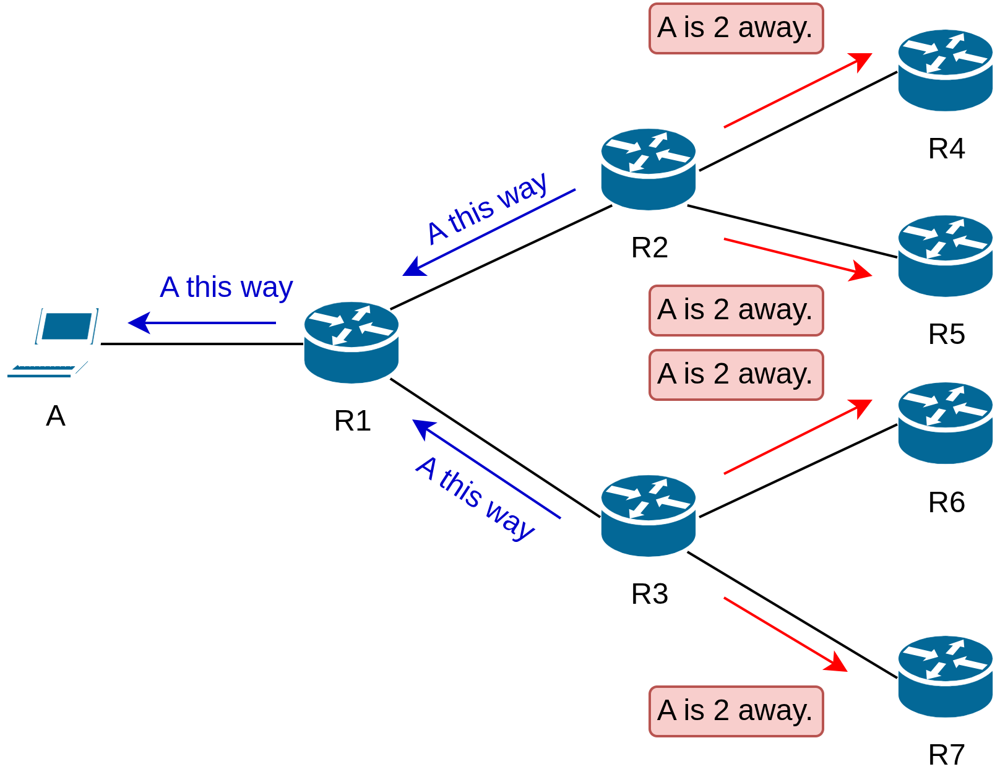
    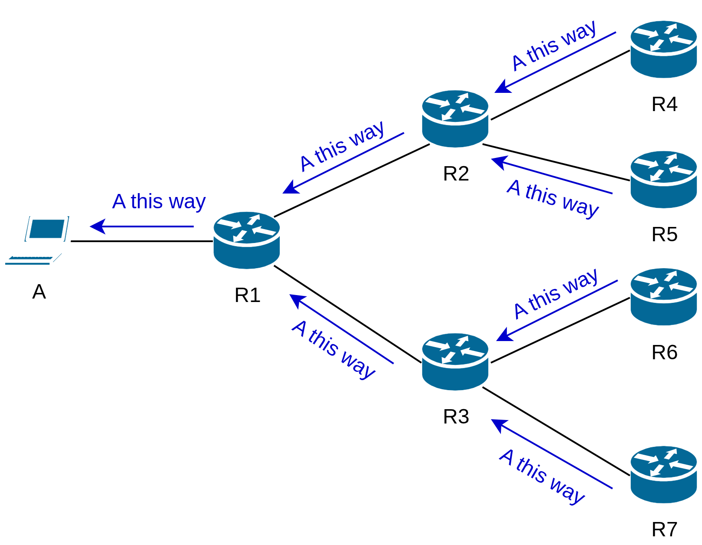
</div>

---

# The Distance Vector Algorithm

Key idea:
- From time to time, each node sends its own distance vector (DV) estimate to neighbors.
- When *x* receives a new DV estimate from any neighbor, it updates its own DV using Bellman–Ford equation.
- Update rule (for every destination *y ∈ N*):
  - ***D<sub>x</sub>(y) ← min<sub>v</sub>{c<sub>x,v</sub> + D<sub>v</sub>(y)}***
    - Where:
      - *min* taken over all neighbors *v* of *x*
      -  c<sub>x,v</sub> = direct cost of link from *x* to *v*
      -  D<sub>v</sub>(y) = estimated least-cost-path cost to *y*
-  Under minor, natural conditions, the estimate *D<sub>x</sub>(y)* converge to the actual least cost *d<sub>x</sub>(y)*.

---

# The Distance Vector Algorithm

**Each node independently performs the following:**
1. Waits for a change in a local link cost or a message from a neighbor.
2. Recomputes its DV estimates using the DV received from the neighbor.
3. If the DV to any destination changes, it notifies its neighbors.

Key properties:
- **Iterative, asynchronous** -> each local iteration is triggered by:
  - A local link-cost change
  - A DV update message from a neighbor
- **Distributed, self-stopping** -> each node notifies neighbors only when its DV changes
  - Neighbors then notify their neighbors - only if necessary
  - If no notification received, no actions taken.

---

# Rule 1: Bellman-Ford Updates

- Accept the shorter path.

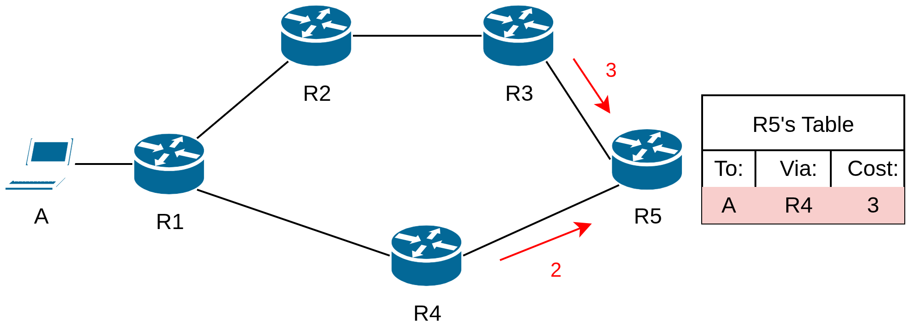

---

# Rule 1: Bellman-Ford Updates

You might not hear about both paths simultaneously.
- In the forwarding table, record the best-known cost to a destination.
- If your table doesn't have a path to a destination, accept any path you hear about.
- If you hear about a better path later, update the table (next-hop and cost).

<div class="relative h-60">
    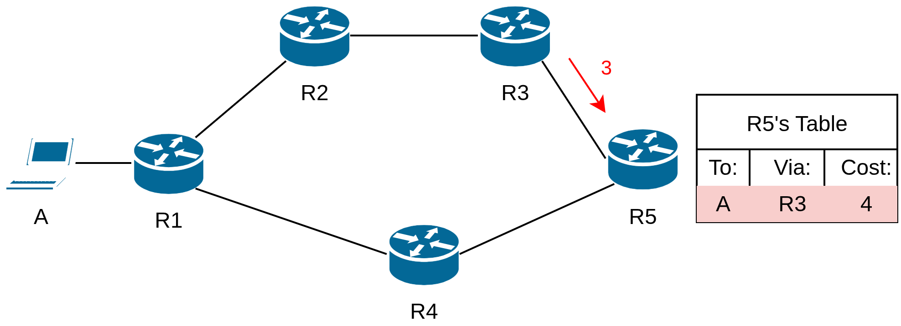
    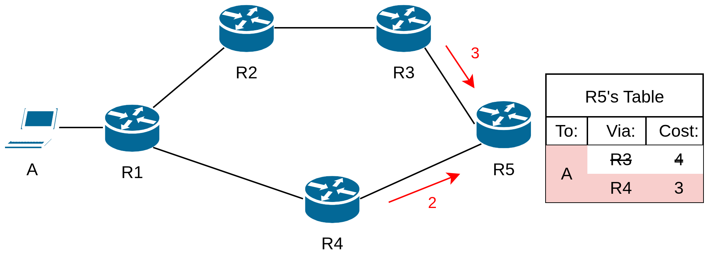
</div>

---

# Rule 1: Bellman-Ford Updates

Not all link costs are 1.

- When a neighbor advertises a path, the cost via that path is the sum of:
  - Link cost from you to the neighbor.
  - Cost from neighbor to destination (as advertised by neighbor).

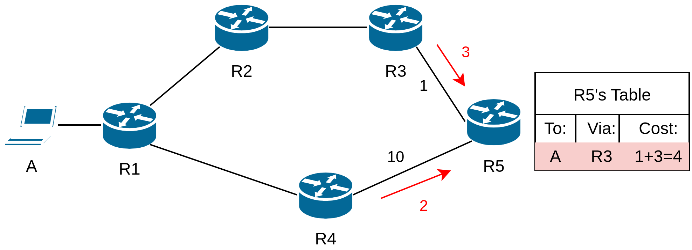

---

# The Distance-Vector Algorithm So Far

For each destination:
- If you hear about a path to that destination, update table if:
  - **The destination isn't in the table.**
  - **Advertised cost + link cost to neighbor < best-known cost. (#1)**
- Then, tell all your neighbors.

---

# Rule 2: Updates from Next-Hop 

- Up to this point, we have updated only when a better path was found (or when no path existed previously), but the topology may change.
- If our current next hop sends us an announcement, accept it, even if the path is worse.
  - This lets the next-hop notify us if the topology changed.

<div class="relative h-60">
    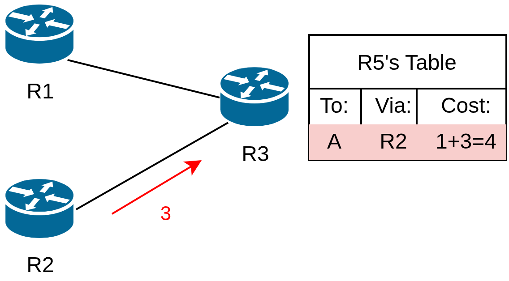
    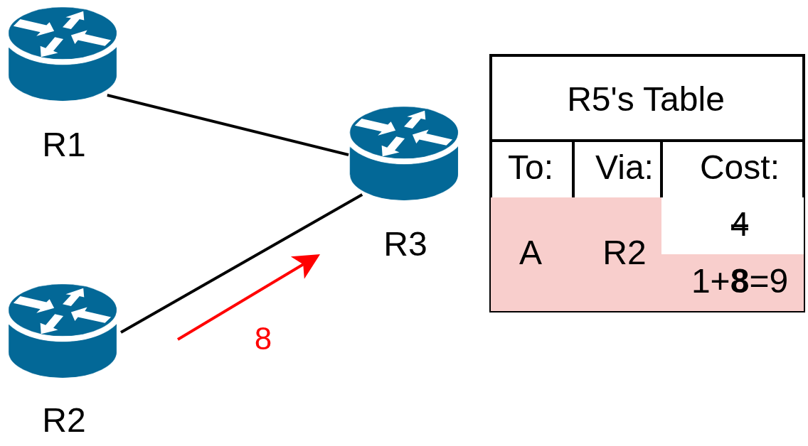
</div>

---

# Convergence

If the network never changes:
- After running this protocol for some time, it will converge.
- Everyone's forwarding table has the least-cost next hop.
- All future announcements will be rejected.

If a change happens (e.g. a link goes down):
- Some new announcements are sent.
- Some forwarding tables are updated.
- Eventually, we converge again to the new routing state.

The network topology is constantly changing, so routers run the protocol indefinitely.
- Steady-state occurs when the network has converged.
- In steady-state, everything stays the same until the next topology change.
---

# The Distance-Vector Algorithm So Far

For each destination:
- If you hear an advertisement, update table if:
  - The destination isn't in the table.
  - Advertised cost + link cost to neighbor < best-known cost. (#1)
  - **The advertisement is from current next-hop. (#2)**
- Then, advertise to all your neighbors.
---

# Bellman-Ford Demo - Initial State (t=0)

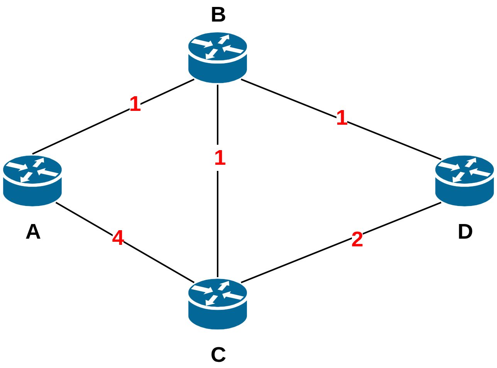

<div style="zoom: 0.75; display: inline-block; margin-left: 0px;">
Node: A

| To | Cost | Via |
|----|------|-----|
| A  | 0 | A |
| B  | 1 | B |
| C  | 4 | C |
| D  | ∞ | - |
</div>

<div style="zoom: 0.75; display: inline-block; margin-left: 210px;">
Node: B

| To | Cost | Via |
|----|------|-----|
| A  | 1 | A |
| B  | 0 | B |
| C  | 1 | C |
| D  | 1 | D |
</div>

<div style="zoom: 0.75; display: inline-block; margin-left: 210px;">
Node: C

| To | Cost | Via |
|----|------|-----|
| A  | 4 | A |
| B  | 1 | B |
| C  | 0 | C |
| D  | 2 | D | 
</div>


<div style="zoom: 0.75; display: inline-block; margin-left: 210px;">
Node: D

| To | Cost | Via |
|----|------|-----|
| A  | ∞ | - |
| B  | 1 | B |
| C  | 2 | C |
| D  | 0 | D |
</div>
---

# Bellman-Ford Demo - A (t=1)

*A* receives DVs from *B, C*


<div style="zoom: 0.75; display: inline-block; margin: 0 0px;">
Node: A

| To | Cost | A <- B | A <- C | Via |
|----|------|--------|--------|-----|
| A  | 0 | 1+1 | 4+4 | A |
| B  | 1 | 1+0 | 4+1 | B |
| C  | 4 | 1+1 | 4+0 | C |
| D  | ∞ | 1+1 | 4+2 | - |
</div>

<div style="zoom: 0.75; display: inline-block; margin-left: 75px;">
Node: B

| To | Cost | Via |
|----|------|-----|
| A  | 1 | A |
| B  | 0 | B |
| C  | 1 | C |
| D  | 1 | D |
</div>

<div style="zoom: 0.75; display: inline-block; margin-left: 210px;">
Node: C

| To | Cost | Via |
|----|------|-----|
| A  | 4 | A |
| B  | 1 | B |
| C  | 0 | C |
| D  | 2 | D | 
</div>


<div style="zoom: 0.75; display: inline-block; margin-left: 210px;">
Node: D

| To | Cost | Via |
|----|------|-----|
| A  | ∞ | - |
| B  | 1 | B |
| C  | 2 | C |
| D  | 0 | D |
</div>
---

# Bellman-Ford Demo - A (t=1)

*A* receives DVs from *B, C*


<div style="zoom: 0.75; display: inline-block; margin: 0 0px;">
Node: A

| To | Cost | A <- B | A <- C | Via |
|----|------|--------|--------|-----|
| A  | <span class="text-red-600 font-bold">0</span> | 1 | 8 | A |
| B  | <span class="text-red-600 font-bold">1</span> | 1 | 5 | B |
| C  | 4 | <span class="text-red-600 font-bold">2</span> | 4 | C |
| D  | ∞ | <span class="text-red-600 font-bold">2</span> | 6 | - |
</div>

<div style="zoom: 0.75; display: inline-block; margin-left: 75px;">
Node: B

| To | Cost | Via |
|----|------|-----|
| A  | 1 | A |
| B  | 0 | B |
| C  | 1 | C |
| D  | 1 | D |
</div>

<div style="zoom: 0.75; display: inline-block; margin-left: 210px;">
Node: C

| To | Cost | Via |
|----|------|-----|
| A  | 4 | A |
| B  | 1 | B |
| C  | 0 | C |
| D  | 2 | D | 
</div>


<div style="zoom: 0.75; display: inline-block; margin-left: 210px;">
Node: D

| To | Cost | Via |
|----|------|-----|
| A  | ∞ | - |
| B  | 1 | B |
| C  | 2 | C |
| D  | 0 | D |
</div>
---

# Bellman-Ford Demo - A (t=1)

*A* receives DVs from *B, C*


<div style="zoom: 0.75; display: inline-block; margin: 0 0px;">
Node: A

| To | Cost | Via |
|----|------|-----|
| A  | 0 | <span class="text-red-600 font-bold">A</span> |
| B  | 1 | <span class="text-red-600 font-bold">B</span> |
| C  | 2 | <span class="text-red-600 font-bold">B</span> |
| D  | 2 | <span class="text-red-600 font-bold">B</span> |
</div>

<div style="zoom: 0.75; display: inline-block; margin-left: 210px;">
Node: B

| To | Cost | Via |
|----|------|-----|
| A  | 1 | A |
| B  | 0 | B |
| C  | 1 | C |
| D  | 1 | D |
</div>

<div style="zoom: 0.75; display: inline-block; margin-left: 210px;">
Node: C

| To | Cost | Via |
|----|------|-----|
| A  | 4 | A |
| B  | 1 | B |
| C  | 0 | C |
| D  | 2 | D | 
</div>


<div style="zoom: 0.75; display: inline-block; margin-left: 210px;">
Node: D

| To | Cost | Via |
|----|------|-----|
| A  | ∞ | - |
| B  | 1 | B |
| C  | 2 | C |
| D  | 0 | D |
</div>
---

# Bellman-Ford Demo - B (t=1)

*B* receives DVs from *A, C, D*


<div style="zoom: 0.75; display: inline-block; margin: 0 0px;">
Node: A

| To | Cost | Via |
|----|------|-----|
| A  | 0 | A |
| B  | 1 | B |
| C  | 4 | C |
| D  | ∞ | - |
</div>

<div style="zoom: 0.75; display: inline-block; margin-left: 107px;">
Node: B

| To | Cost | B <- A | B <- C | B <- D | Via |
|----|------|--------|--------|--------|-----|
| A  | 1 | 1+0 | 1+4 | 1+∞ | A |
| B  | 0 | 1+1 | 1+1 | 1+1 | B |
| C  | 1 | 1+4 | 1+0 | 1+2 | C |
| D  | 1 | 1+∞ | 1+2 | 1+0 | D |
</div>

<div style="zoom: 0.75; display: inline-block; margin-left: 110px;">
Node: C

| To | Cost | Via |
|----|------|-----|
| A  | 4 | A |
| B  | 1 | B |
| C  | 0 | C |
| D  | 2 | D | 
</div>


<div style="zoom: 0.75; display: inline-block; margin-left: 210px;">
Node: D

| To | Cost | Via |
|----|------|-----|
| A  | ∞ | - |
| B  | 1 | B |
| C  | 2 | C |
| D  | 0 | D |
</div>
---

# Bellman-Ford Demo - B (t=1)

*B* receives DVs from *A, C, D*


<div style="zoom: 0.75; display: inline-block; margin: 0 0px;">
Node: A

| To | Cost | Via |
|----|------|-----|
| A  | 0 | A |
| B  | 1 | B |
| C  | 4 | C |
| D  | ∞ | - |
</div>

<div style="zoom: 0.75; display: inline-block; margin-left: 107px;">
Node: B

| To | Cost | B <- A | B <- C | B <- D | Via |
|----|------|--------|--------|--------|-----|
| A  | <span class="text-red-600 font-bold">1</span> | 1 | 5 | ∞ | A |
| B  | <span class="text-red-600 font-bold">0</span> | 2 | 2 | 2 | B |
| C  | <span class="text-red-600 font-bold">1</span> | 5 | 1 | 3 | C |
| D  | <span class="text-red-600 font-bold">1</span> | ∞ | 3 | 1 | D |
</div>

<div style="zoom: 0.75; display: inline-block; margin-left: 110px;">
Node: C

| To | Cost | Via |
|----|------|-----|
| A  | 4 | A |
| B  | 1 | B |
| C  | 0 | C |
| D  | 2 | D | 
</div>


<div style="zoom: 0.75; display: inline-block; margin-left: 210px;">
Node: D

| To | Cost | Via |
|----|------|-----|
| A  | ∞ | - |
| B  | 1 | B |
| C  | 2 | C |
| D  | 0 | D |
</div>
---

# Bellman-Ford Demo - B (t=1)

*B* receives DVs from *A, C, D*


<div style="zoom: 0.75; display: inline-block; margin: 0 0px;">
Node: A

| To | Cost | Via |
|----|------|-----|
| A  | 0 | A |
| B  | 1 | B |
| C  | 4 | C |
| D  | ∞ | - |
</div>

<div style="zoom: 0.75; display: inline-block; margin-left: 210px;">
Node: B

| To | Cost | Via |
|----|------|-----|
| A  | 1 | <span class="text-red-600 font-bold">A</span> |
| B  | 0 | <span class="text-red-600 font-bold">B</span> |
| C  | 1 | <span class="text-red-600 font-bold">C</span> |
| D  | 1 | <span class="text-red-600 font-bold">D</span> |
</div>

<div style="zoom: 0.75; display: inline-block; margin-left: 210px;">
Node: C

| To | Cost | Via |
|----|------|-----|
| A  | 4 | A |
| B  | 1 | B |
| C  | 0 | C |
| D  | 2 | D | 
</div>


<div style="zoom: 0.75; display: inline-block; margin-left: 210px;">
Node: D

| To | Cost | Via |
|----|------|-----|
| A  | ∞ | - |
| B  | 1 | B |
| C  | 2 | C |
| D  | 0 | D |
</div>
---

# Bellman-Ford Demo - C (t=1)

*C* receives DVs from *A, B, D*


<div style="zoom: 0.75; display: inline-block; margin: 0 0px;">
Node: A

| To | Cost | Via |
|----|------|-----|
| A  | 0 | A |
| B  | 1 | B |
| C  | 4 | C |
| D  | ∞ | - |
</div>

<div style="zoom: 0.75; display: inline-block; margin-left: 210px;">
Node: B

| To | Cost | Via |
|----|------|-----|
| A  | 1 | A |
| B  | 0 | B |
| C  | 1 | C |
| D  | 1 | D |
</div>

<div style="zoom: 0.75; display: inline-block; margin-left: 107px;">
Node: C

| To | Cost | C <- A | C <- B | C <- D | Via |
|----|------|--------|--------|--------|-----|
| A  | 4 | 4+0 | 1+1 | 2+∞ | A |
| B  | 1 | 4+1 | 1+0 | 2+1 | B |
| C  | 0 | 4+4 | 1+1 | 2+2 | C |
| D  | 2 | 4+∞ | 1+1 | 2+0 | D |
</div>


<div style="zoom: 0.75; display: inline-block; margin-left: 110px;">
Node: D

| To | Cost | Via |
|----|------|-----|
| A  | ∞ | - |
| B  | 1 | B |
| C  | 2 | C |
| D  | 0 | D |
</div>
---

# Bellman-Ford Demo - C (t=1)

*C* receives DVs from *A, B, D*


<div style="zoom: 0.75; display: inline-block; margin: 0 0px;">
Node: A

| To | Cost | Via |
|----|------|-----|
| A  | 0 | A |
| B  | 1 | B |
| C  | 4 | C |
| D  | ∞ | - |
</div>

<div style="zoom: 0.75; display: inline-block; margin-left: 210px;">
Node: B

| To | Cost | Via |
|----|------|-----|
| A  | 1 | A |
| B  | 0 | B |
| C  | 1 | C |
| D  | 1 | D |
</div>

<div style="zoom: 0.75; display: inline-block; margin-left: 107px;">
Node: C

| To | Cost | C <- A | C <- B | C <- D | Via |
|----|------|--------|--------|--------|-----|
| A  | 4 | 4 | <span class="text-red-600 font-bold">2</span> | ∞ | A |
| B  | <span class="text-red-600 font-bold">1</span> | 5 | 1 | 3 | B |
| C  | <span class="text-red-600 font-bold">0</span> | 8 | 2 | 4 | C |
| D  | <span class="text-red-600 font-bold">2</span> | ∞ | 2 | 2 | D |
</div>


<div style="zoom: 0.75; display: inline-block; margin-left: 110px;">
Node: D

| To | Cost | Via |
|----|------|-----|
| A  | ∞ | - |
| B  | 1 | B |
| C  | 2 | C |
| D  | 0 | D |
</div>
---

# Bellman-Ford Demo - C (t=1)

*C* receives DVs from *A, B, D*


<div style="zoom: 0.75; display: inline-block; margin-length: 0px;">
Node: A

| To | Cost | Via |
|----|------|-----|
| A  | 0 | A |
| B  | 1 | B |
| C  | 4 | C |
| D  | ∞ | - |
</div>

<div style="zoom: 0.75; display: inline-block; margin-left: 210px;">
Node: B

| To | Cost | Via |
|----|------|-----|
| A  | 1 | A |
| B  | 0 | B |
| C  | 1 | C |
| D  | 1 | D |
</div>

<div style="zoom: 0.75; display: inline-block; margin-left: 210px;">
Node: C

| To | Cost | Via |
|----|------|-----|
| A  | 2 | <span class="text-red-600 font-bold">B</span> |
| B  | 1 | <span class="text-red-600 font-bold">B</span> |
| C  | 0 | <span class="text-red-600 font-bold">C</span> |
| D  | 2 | <span class="text-red-600 font-bold">D</span> |
</div>


<div style="zoom: 0.75; display: inline-block; margin-left: 210px;">
Node: D

| To | Cost | Via |
|----|------|-----|
| A  | ∞ | - |
| B  | 1 | B |
| C  | 2 | C |
| D  | 0 | D |
</div>
---

# Bellman-Ford Demo - D (t=1)

*D* receives DVs from *B, C*


<div style="zoom: 0.75; display: inline-block; margin-length: 0 0px;">
Node: A

| To | Cost | Via |
|----|------|-----|
| A  | 0 | A |
| B  | 1 | B |
| C  | 4 | C |
| D  | ∞ | - |
</div>

<div style="zoom: 0.75; display: inline-block; margin-left: 210px;">
Node: B

| To | Cost | Via |
|----|------|-----|
| A  | 1 | A |
| B  | 0 | B |
| C  | 1 | C |
| D  | 1 | D |
</div>

<div style="zoom: 0.75; display: inline-block; margin-left: 210px;">
Node: C

| To | Cost | Via |
|----|------|-----|
| A  | 4 | A |
| B  | 1 | B |
| C  | 0 | C |
| D  | 2 | D | 
</div>


<div style="zoom: 0.75; display: inline-block; margin-left: 80px;">
Node: D

| To | Cost | D <- B | D <- C | Via |
|----|------|--------|--------|-----|
| A  | ∞ | 1+1 | 2+4 | - |
| B  | 1 | 1+0 | 2+1 | B |
| C  | 2 | 1+1 | 2+0 | C |
| D  | 0 | 1+1 | 2+2 | D |
</div>
---

# Bellman-Ford Demo - D (t=1)

*D* receives DVs from *B, C*


<div style="zoom: 0.75; display: inline-block; margin: 0 0px;">
Node: A

| To | Cost | Via |
|----|------|-----|
| A  | 0 | A |
| B  | 1 | B |
| C  | 4 | C |
| D  | ∞ | - |
</div>

<div style="zoom: 0.75; display: inline-block; margin-left: 210px;">
Node: B

| To | Cost | Via |
|----|------|-----|
| A  | 1 | A |
| B  | 0 | B |
| C  | 1 | C |
| D  | 1 | D |
</div>

<div style="zoom: 0.75; display: inline-block; margin-left: 210px;">
Node: C

| To | Cost | Via |
|----|------|-----|
| A  | 4 | A |
| B  | 1 | B |
| C  | 0 | C |
| D  | 2 | D | 
</div>


<div style="zoom: 0.75; display: inline-block; margin-left: 80px;">
Node: D

| To | Cost | D <- B | D <- C | Via |
|----|------|--------|--------|-----|
| A  | ∞ |  <span class="text-red-600 font-bold">2</span> | 6 | - |
| B  |  <span class="text-red-600 font-bold">1</span> | 1 | 3 | B |
| C  |  <span class="text-red-600 font-bold">2</span> | 2 | 2 | C |
| D  |  <span class="text-red-600 font-bold">0</span> | 2 | 4 | D |
</div>
---

# Bellman-Ford Demo - D (t=1)

*D* receives DVs from *B, C*


<div style="zoom: 0.75; display: inline-block; margin: 0 0px;">
Node: A

| To | Cost | Via |
|----|------|-----|
| A  | 0 | A |
| B  | 1 | B |
| C  | 4 | C |
| D  | ∞ | - |
</div>

<div style="zoom: 0.75; display: inline-block; margin-left: 210px;">
Node: B

| To | Cost | Via |
|----|------|-----|
| A  | 1 | A |
| B  | 0 | B |
| C  | 1 | C |
| D  | 1 | D |
</div>

<div style="zoom: 0.75; display: inline-block; margin-left: 210px;">
Node: C

| To | Cost | Via |
|----|------|-----|
| A  | 4 | A |
| B  | 1 | B |
| C  | 0 | C |
| D  | 2 | D | 
</div>


<div style="zoom: 0.75; display: inline-block; margin-left: 210px;">
Node: D

| To | Cost | Via |
|----|------|-----|
| A  | 2 | <span class="text-red-600 font-bold">B</span> |
| B  | 1 | <span class="text-red-600 font-bold">B</span> |
| C  | 2 | <span class="text-red-600 font-bold">C</span> |
| D  | 0 | <span class="text-red-600 font-bold">D</span> |
</div>
---

# Bellman-Ford Demo - A,B,C,D (t=2, 3 ...)

... and so on

---

# Bellman-Ford Demo - Converged State


<div style="zoom: 0.75; display: inline-block; margin-left: 0px;">
Node: A

| To | Cost | Via | 
|----|------|-----|
| A  | 0 | A |
| B  | 1 | B |
| C  | 2 | B |
| D  | 2 | B |
</div>

<div style="zoom: 0.75; display: inline-block; margin-left: 210px;">
Node: B

| To | Cost | Via |
|----|------|-----|
| A  | 1 | A |
| B  | 0 | B |
| C  | 1 | C |
| D  | 1 | D |
</div>

<div style="zoom: 0.75; display: inline-block; margin-left: 210px;">
Node: C

| To | Cost | Via |
|----|------|-----|
| A  | 2 | B | 
| B  | 1 | B |
| C  | 0 | C |
| D  | 2 | D |
</div>


<div style="zoom: 0.75; display: inline-block; margin-left: 210px;">
Node: D

| To | Cost | Via | 
|----|------|-----|
| A  | 2 | B |
| B  | 1 | B |
| C  | 2 | C |
| D  | 0 | D|
</div>
---

# Rule 3: Resending

- Packets can get dropped.

Solution: Resend advertisements every X seconds.
  - X is the *advertisement interval*.
  - This should work eventually, assuming the link is functional (>0% delivery rate).

---

# The Distance-Vector Algorithm So Far

For each destination:
- If you hear an advertisement, update table if:
  - The destination isn't in the table.
  - Advertised cost + link cost to neighbor < best-known cost. (#1)
  - The advertisement is from current next-hop. (#2)
- Advertise to all your neighbors **when the table updates, and periodically.** (#3)
---

# Rule 4: Expiring

- Links and routers can fail.

- Solution: Each route has a finite **time to live (TTL)**.
  - Periodic advertisements help us confirm that a route still exists.
    - When we get an advertisement, reset ("recharge") the TTL.
- If a link goes down, we stop getting periodic updates, and the TTL will expire.
  - If the TTL expires, delete the entry from the table.
<div class="relative h-45">
    
    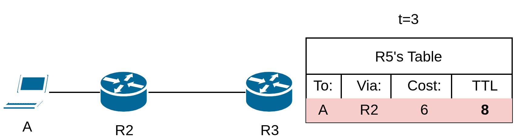
    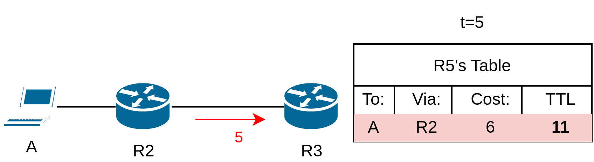
    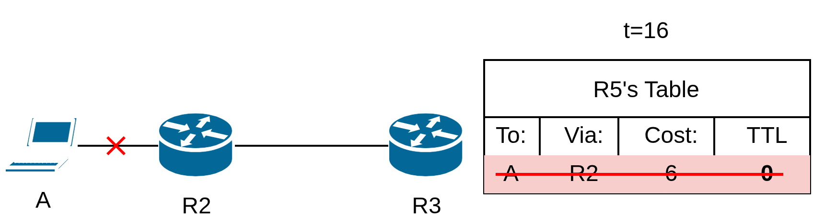
</div>
---

# Timers

Routers maintain multiple timers:
- Advertisement interval: How long before we advertise routes to neighbors.
  - Usually one timer for all entries in the table.
- TTL: How long before we expire a route.
  - Each table entry has its own TTL.
---

# The Distance-Vector Algorithm (Basic rules)

For each destination:
- If you hear an advertisement, update table and **reset TTL** if:
  - The destination isn't in the table.
  - Advertised cost + link cost to neighbor < best-known cost. (#1)
  - The advertisement is from current next-hop. (#2)
- Advertise to all your neighbors when the table updates, and periodically. (#3)
- **If a table entry expires, delete it. (#4)**

This is a mostly-functional protocol now. 

---

# Distance-Vector - Defenses Against Routing Loops

Problem: slow convergence + routing loops when a route fails

Solutions :

<div style="zoom: 0.65; display: inline-block;">

| Technique             | How it works                                                                                         | What it prevents / helps with                              |
|-----------------------|------------------------------------------------------------------------------------------------------|------------------------------------------------------------|
| **Route Poisoning**       | When a route fails, immediately advertise it with **infinite metric**         | Tells neighbors quickly that the route is dead             |
| **Split Horizon**         | Never advertise a route back out the interface you learned it from                                 | Prevents immediate 2-router loops                          |
| **Poison Reverse**        | Actively advertise **infinite metric** back toward the neighbor who gave you the route              | Stronger version of split horizon – breaks 2-router loops  |
| **Hold-down timers**      | Ignore better metrics for a while after hearing a route is down | Prevents flapping and re-learning bad routes too quickly   |
| **Maximum metric (“infinity”)** | Define a maximum value (≥16 = unreachable)                               | Bounds the count-to-infinity problem                       |
</div>

- Split horizon + poison reverse completely eliminate **2-router loops**  
- **Loops with 3 or more routers** still possible -> "count-to-infinity"  
  - Maximum metric limits the duration of the problem
--- 
layout: three-slots
---

# Link-State Protocols vs Distance-Vector Protocols

::left::

- **Global data:** Each node knows about the full network graph.
- **Local computation:** Each node computes the full solution by itself.
- Each node sends a vector of the states of its directly connected links.
- Advertisement messages are send to all routers in the area (flooding).
- Advertisement messages are sent whenever changes occur.
- **Robustness:** A router may advertise a wrong link cost. Only its own table is affected.

::right::

- **Local data:** Each node only knows about part of the network.
- **Global (distributed) computation:** Each node computes part of the solution, working with other nodes.
- Each node sends a distance vector containing the distances to all known destinations.
- Advertisement messages are sent to only direct neighbors.
- Advertisement messages are sent both periodically and whenever changes occur.
- **Robustness:** A router may advertise a wrong path cost, causing black-holing. Errors propagate through the network.
---
layout: section
---

# Inter-Domain Routing

---

# Autonomous Systems

**Autonomous System (AS):** One or more local networks, all under a single administrative control.
- Example: Sanet AS might contain universities, colleges, research institutes ...
- Sometimes informally called "domains."

Each AS is assigned a unique AS number (ASN).
- Example: SANET is ASN 2607

---

# AS Graph

**Inter-domain topology (or AS graph):** A graph of ASes, with the individual routers and hosts abstracted away. Each node is an AS.

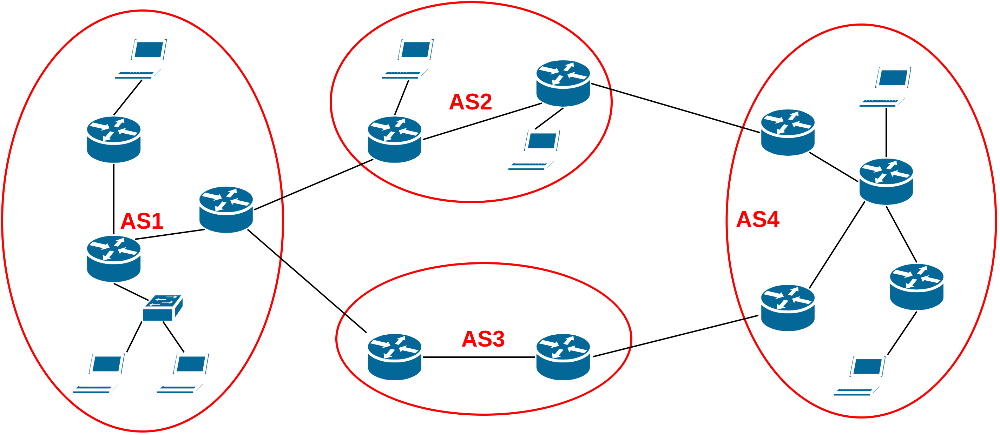

---
layout: three-slots
---

# Types of Autonomous Systems

::left::
**Stub AS:** Only sends/receives packets on behalf of hosts inside the AS.
- Similar to end hosts in intra-domain model.
- Does not forward packets between other ASes.
- Examples: Sanet, local bank.
- Most ASes are this type.

::right::
**Transit AS:** Forwards packets on behalf of other ASes.
- Similar to routers in intra-domain model.
- Can still send/receive packets for hosts inside the AS.
- Examples: AT&T, Verizon.
- Can vary in scale (global, regional).
---

# Business Relationships

Inter-domain topology is shaped between business relationships between ASes.

Two different ways for a pair of ASes to be related:
- Customer-provider relationship:
  - The customer pays the provider.
  - In exchange, the provider offers to forward traffic to/from the customer.
- Peering relationship:
  - Peers don't pay each other.
  - Peers exchange roughly equal traffic.
---

# AS Graph with Business Relationships

Representing business relationships in the AS graph:
- Provider  ----> Customer
- Peer ----- Peer
The arrows do not represent direction of packets (e.g. F can send packets to C).

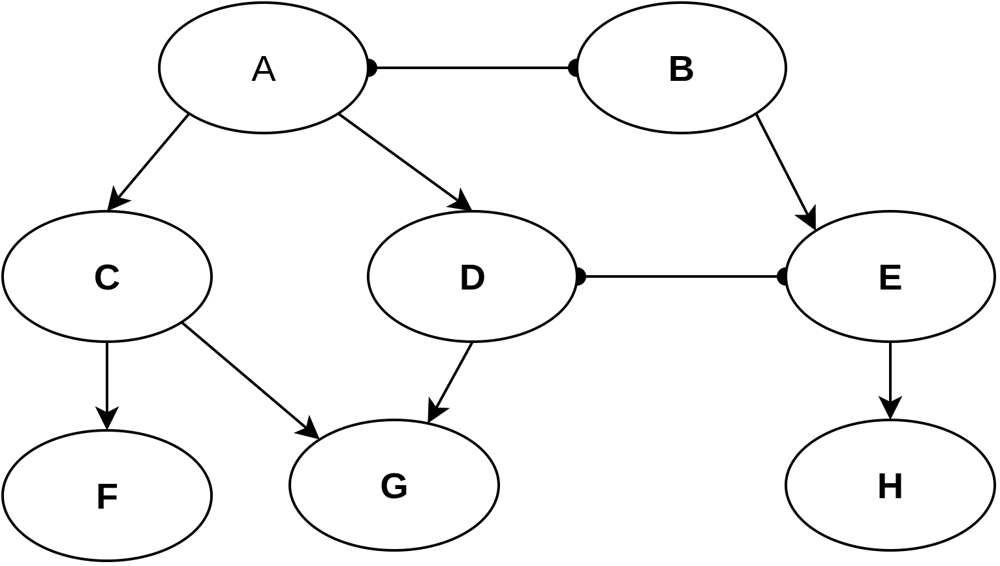
---

# AS Graph with Business Relationships

Stub ASes in this graph: F, G, H.

No outgoing edges: Not providing service to anybody.

Incoming edge(s) shows who they're buying service from.

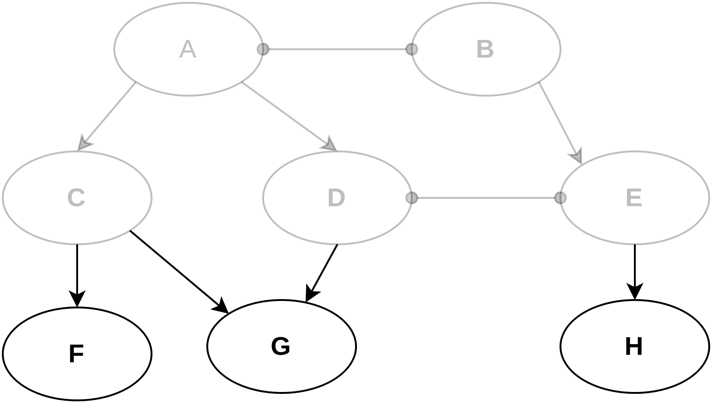

---

# AS Graph with Business Relationships

Transit ASes in this graph: A, B, C, D, E.

Outgoing edges indicate they're providing service to somebody.

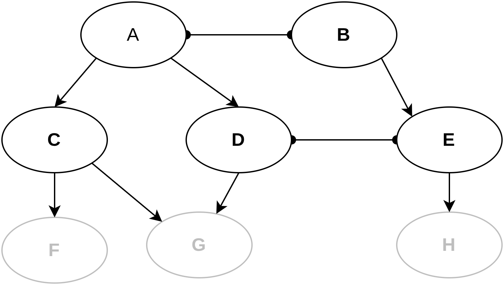

---

# AS Graph is Acyclic

The AS graph has no cycles.
- A cycle means you're paying yourself, which doesn't make sense.
- A cycle of peering relationships is okay.

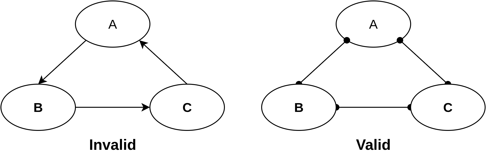

---

# Provider Hierarchy

The AS graph forms a **hierarchy** (all arrows point down).
- Service flows down: Higher nodes provide service to lower nodes.
- Money flows up: Lower nodes pay money to higher nodes.

**Tier 1 ASes**: ASes at the top of the hierarchy.
- Has no providers (no incoming edges).
- Has a peering relationship with every other Tier 1 AS (AS graph is connected).


---

# Goals of Inter-Domain Routing

Scalability: Routing must scale to the entire Internet.
- Solution: Hierarchical IP addressing.

Privacy: ASes don't want to explicitly announce sensitive information.
- I shouldn't have to tell everybody who my provider is.
- Companies might not want to reveal information to rivals.
- "Explicitly" - Some minor leakage is inevitable.

Autonomy: ASes want the freedom to choose their own policies.
- Policy is usually based on business goals.
---

# Policy-Based Routing

Autonomy: ASes want the freedom to choose their own policies.

Examples of policies:
- Define how I will handle traffic from others:
  - I don't want to carry AS#2046's traffic through my network.
- Defines how others should handle my traffic:
  - I prefer if my traffic was carried by AS#10 instead of AS#4.
  - Don't send my traffic through AS#54 unless absolutely necessary.
- More creative policies:
  - I prefer AS#12 on weekdays, and AS#13 on weekends.

We have to find paths that respect every AS's policies.

---

# Gao-Rexford Rules

In practice, most ASes follow standard conventions: Gao-Rexford Rules.

Gao-Rexford rules: Prefer the most profitable path.
- Best: Path where the next hop is a customer. (They pay me.)
- Less good: Path where the next hop is a peer. (I don't make money.)
- Worst: Path where the next hop is a provider. (I have to pay.)

In contrast, the distance-vector protocol prefers the shortest path.

Reflects real-world business practice: Making money is good.

---

# BGP (Border Gateway Protocol)

-  inter-domain routing protocol
   -  *glue that holds the Internet together*
-  allows subnet to advertise its existence, and the destinations it can reach, to rest of Internet: "I am here, here is who I can reach, and how"
-  BGP provides each AS a means to:
   - obtain destination network reachability info from neighboring ASes (eBGP)
   - determine routes to other networks based on reachability information and policy
   - propagate reachability information to all AS-internal routers (iBGP)
   - advertise (to neighboring networks) destination reachability info
---

# eBGP, iBGP connections

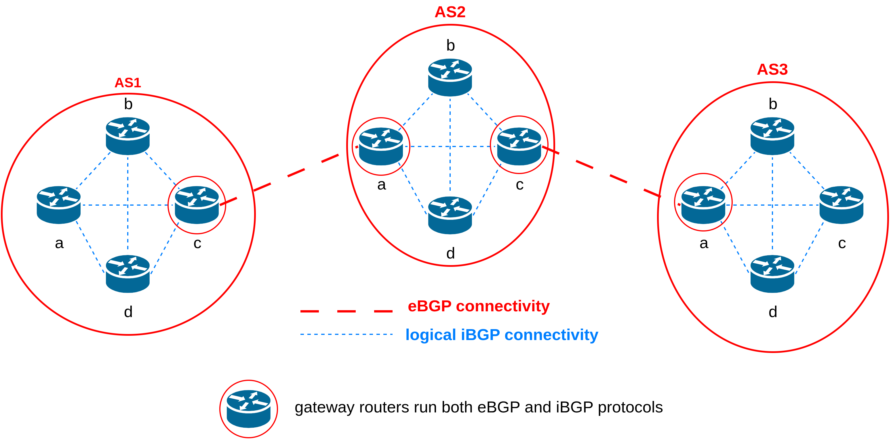
---

# BGP basics

BGP session: two BGP routers ("peers") exchange BGP messages over semi-permanent TCP connection:
- advertising paths to different destination network prefixes (BGP  is a "path vector" protocol)

When AS3 gateway 3a advertises path ***AS3,X*** to AS2 gateway 2c:
- AS3 promises to AS2 it will forward datagrams towards X

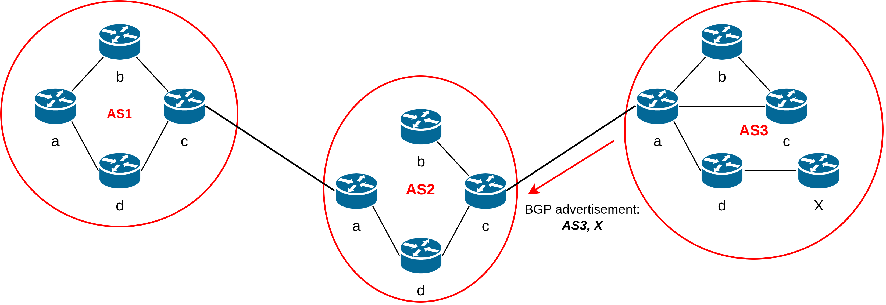
---

# Path attributes and BGP routes

BGP advertised route:  prefix + attributes 
- prefix: destination being advertised
- two important attributes:
  - **AS-PATH:** list of ASes through which prefix advertisement has passed
  - **NEXT-HOP:** indicates specific internal-AS router to next-hop AS

**policy-based routing**:
- gateway receiving route advertisement uses import policy to accept/decline path (e.g., never route through AS Y).
- AS policy also determines whether to advertise path to other other neighboring ASes

---

# BGP path advertisement

- AS2 router 2c receives path advertisement ***AS3,X*** (via eBGP) from AS3 router 3a
- based on AS2 policy, AS2 router 2c accepts path AS3,X, propagates (via iBGP) to all AS2 routers
- based on AS2 policy, AS2 router 2a advertises (via eBGP) path ***AS2,AS3,X*** to AS1 router 1c

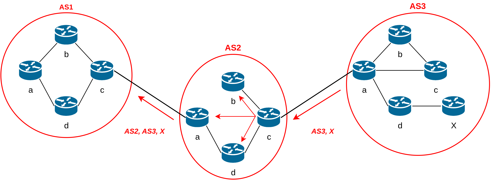

---

# BGP path advertisement: multiple paths

gateway router may learn about multiple paths to destination:
- AS1 gateway router 1c learns path ***AS2,AS3,X*** from 2a
- AS1 gateway router 1c learns path ***AS3,X*** from 3a
- based on policy, AS1 gateway router 1c chooses path ***AS3,X*** and advertises path within AS1 via iBGP

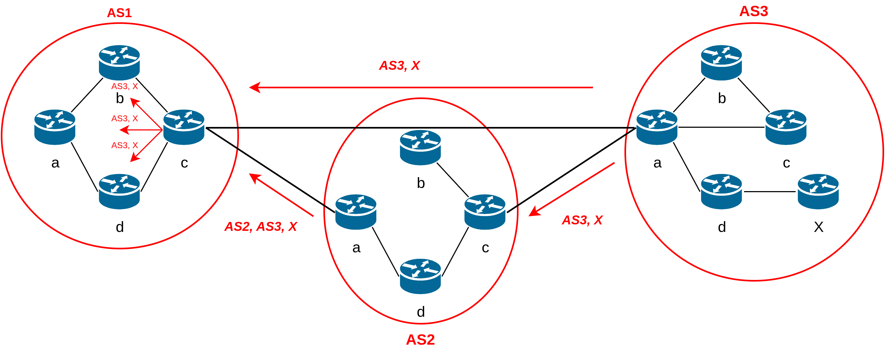
---

# Why different Intra-, Inter-AS routing ? 

**policy:**
- inter-AS: admin wants control over how its traffic routed, who routes through its network 
- intra-AS: single admin, so policy less of an issue

**scale:**
- hierarchical routing saves table size, reduced update traffic

**performance:** 
- intra-AS: can focus on performance
- inter-AS: policy dominates over performance
---

# Routing Protocols - Roadmap

| | Intra-domain (IGP) | Inter-domain (EGP) |
|---------|---------|---------|
| Distance-vector<sup>1</sup> | RIP, EIGRP | - |
| Link-state<sup>1</sup>   | IS-IS, OSPF | - |
| Path-vector<sup>2</sup>  | - | BGP |


Notes:
1. More in the course [Switching and Routing in IP networks](https://is.stuba.sk/katalog/syllabus.pl?predmet=427750;zpet=/katalog/index.pl?obdobi=362,jak=dle_jmena;lang=sk).
2. More in the course [WAN Technologies](https://is.stuba.sk/katalog/syllabus.pl?predmet=431370;zpet=/katalog/index.pl?obdobi=362,jak=dle_jmena;lang=sk).
---

# References
1. KAO, Peyrin. CS 168 Textbook: Introduction to the Internet: Architecture and Protocols. [online]. University of California, Berkeley, 2024 [accessed 2025-09-03]. Available from: https://textbook.cs168.io/
2. KUROSE, James F. and ROSS, Keith W. Computer Networking: a Top Down Approach – authors' website. [online]. University of Massachusetts Amherst, 2025 [accessed 2025-09-03]. Available from: https://gaia.cs.umass.edu/kurose_ross/index.php

<br>

## License

This presentation incorporates material from two sources:

- Portions adapted from **[Peyrin Kao / UC Berkeley]**,
  licensed under [CC BY-SA 4.0](https://creativecommons.org/licenses/by-sa/4.0/).

- Some slides and figures adapted from **J.F. Kurose and K.W. Ross**,  
*Computer Networking: A Top-Down Approach*.  
  © 1993–2025 J.F. Kurose and K.W. Ross. All rights reserved.  
  Used for educational purposes with attribution.
